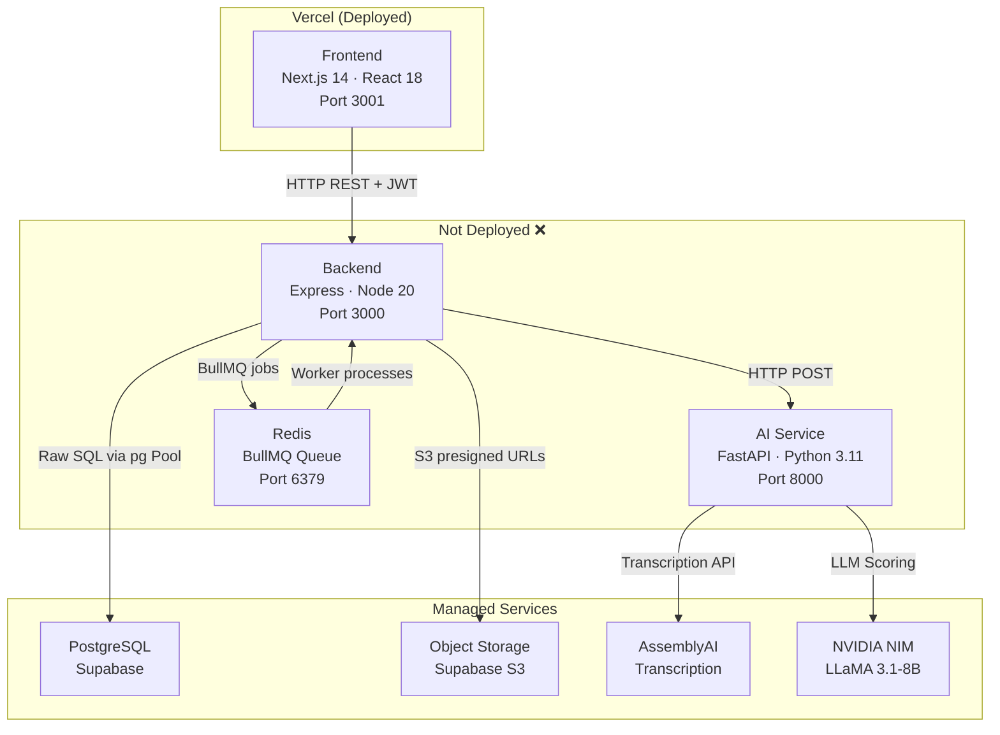
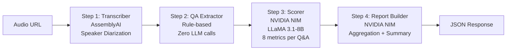
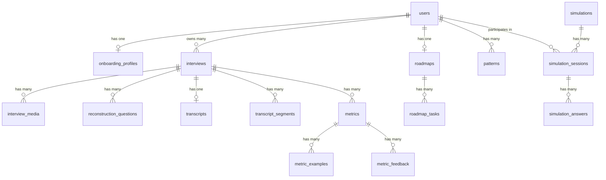

# Sharpen.ai — System Architecture Analysis

> Full architectural analysis of the Sharpen.ai monorepo as of March 27, 2026.

---

## 1. High-Level Architecture



---

## 2. Codebase Metrics

| Metric | Frontend | Backend | AI Service |
|--------|----------|---------|------------|
| **Language** | TypeScript/TSX | TypeScript | Python |
| **Framework** | Next.js 14 (App Router) | Express 4 | FastAPI |
| **Lines of Code** | ~5,000 | ~2,100 | ~1,200 |
| **Route/Page count** | 8 pages | 11 route files | 5 endpoints |
| **Dependencies** | 4 prod | 17 prod | 8 prod |
| **Dockerfile** | ✅ | ✅ | ✅ |
| **Current Deployment** | Vercel ✅ | None ❌ | None ❌ |

---

## 3. Service Breakdown

### 3.1 Frontend (Next.js 14)

**Stack:** Next.js 14 App Router, React 18, Tailwind CSS 3, `@react-oauth/google`

**Page Structure:**
| Route | Purpose |
|-------|---------|
| `/` | Root redirect |
| `/login` | Google OAuth login page |
| `/onboarding/*` | Multi-step onboarding (step-1 through step-3) |
| `/dashboard` | Main dashboard — trend chart, skill snapshot, recent interviews |
| `/dashboard/interviews/[id]` | Individual interview analysis view |
| `/dashboard/record` | Audio recording for live interviews |
| `/dashboard/reconstruct` | Text-based interview reconstruction |
| `/dashboard/prepare` | Learning/study module |
| `/privacy`, `/terms` | Legal pages |

**Auth Model:** Client-side only — JWT stored in `localStorage`, hydrated via React Context ([AuthProvider](file:///Users/apple/Documents/Work/InterviewOs/frontend/src/lib/auth.tsx#28-64)). No server-side session. No token refresh mechanism.

**API Layer:** Single [api.ts](file:///Users/apple/Documents/Work/InterviewOs/frontend/src/lib/api.ts) module with typed fetch wrappers. All calls go to `NEXT_PUBLIC_API_URL` (currently `http://localhost:3000`).

**Components:** Only 4 shared components — `DashboardHeader`, `SharpenLogo`, `ThemeProvider`, `ThemeToggle`. Most UI is inlined in page files.

---

### 3.2 Backend (Express + Node.js)

**Stack:** Express 4, BullMQ, `pg` (raw SQL), JWT, `google-auth-library`, `@aws-sdk/client-s3`, Zod validators

**Route Map (11 files):**
| Route | File | Purpose |
|-------|------|---------|
| `POST /auth/google` | [auth.routes.ts](file:///Users/apple/Documents/Work/InterviewOs/backend/src/routes/auth.routes.ts) | Google OAuth login/signup |
| `POST /auth/signup`, `/login` | Same | Email/password fallback auth |
| `/onboarding/*` | [onboarding.routes.ts](file:///Users/apple/Documents/Work/InterviewOs/backend/src/routes/onboarding.routes.ts) | Profile setup, resume upload |
| `/interviews/*` | [interviews.routes.ts](file:///Users/apple/Documents/Work/InterviewOs/backend/src/routes/interviews.routes.ts) | CRUD, media upload URLs, trigger analysis, reconstruction |
| `/dashboard` | [dashboard.routes.ts](file:///Users/apple/Documents/Work/InterviewOs/backend/src/routes/dashboard.routes.ts) | Aggregated performance data |
| `/gaps` | [gaps.routes.ts](file:///Users/apple/Documents/Work/InterviewOs/backend/src/routes/gaps.routes.ts) | Cross-interview weakness patterns |
| `/roadmap` | [roadmap.routes.ts](file:///Users/apple/Documents/Work/InterviewOs/backend/src/routes/roadmap.routes.ts) | AI-generated improvement tasks |
| `/simulations/*` | [simulations.routes.ts](file:///Users/apple/Documents/Work/InterviewOs/backend/src/routes/simulations.routes.ts) | Practice interview sessions |
| `/learn/generate` | [learn.routes.ts](file:///Users/apple/Documents/Work/InterviewOs/backend/src/routes/learn.routes.ts) | Proxy to AI lesson generation |
| `/profile` | [profile.routes.ts](file:///Users/apple/Documents/Work/InterviewOs/backend/src/routes/profile.routes.ts) | User profile management |
| `/health` | [health.routes.ts](file:///Users/apple/Documents/Work/InterviewOs/backend/src/routes/health.routes.ts) | Health check + diagnostics |
| `/usage` | [usage.routes.ts](file:///Users/apple/Documents/Work/InterviewOs/backend/src/routes/usage.routes.ts) | Usage/limits tracking |

**Middleware:** JWT auth ([auth.middleware.ts](file:///Users/apple/Documents/Work/InterviewOs/backend/src/middleware/auth.middleware.ts)), global error handler, CORS (single origin), Helmet, Morgan logging.

**Background Processing:** BullMQ queue named `interview` with 3 job types:
- [analyze](file:///Users/apple/Documents/Work/InterviewOs/ai-service/main.py#311-368) → Audio pipeline (transcription → scoring)
- `analyze-reconstruction` → Text Q&A scoring
- `analyze-simulation` → Simulation analysis

**Resilience:** Redis is optional — if unavailable, jobs run inline (synchronous). See [queues.ts](file:///Users/apple/Documents/Work/InterviewOs/backend/src/workers/queues.ts).

**DB Access:** Raw `pg` Pool with connection pooling (max 10, keepalive enabled, SSL). No ORM.

---

### 3.3 AI Service (FastAPI + Python)

**Stack:** FastAPI, Uvicorn, AssemblyAI SDK, OpenAI SDK (pointed at NVIDIA NIM), Pydantic v2

**Pipeline Architecture:**


**Endpoints:**
| Endpoint | Called By | Purpose |
|----------|-----------|---------|
| `POST /analyze` | Backend worker | Full audio pipeline (transcribe → score → report) |
| `POST /analyze-reconstruction` | Backend worker | Score pre-structured Q&A pairs (no transcription) |
| `POST /analyze-text` | Backend worker | Raw text analysis for simulations |
| `POST /generate-lesson` | Backend `/learn` proxy | AI-generated topic lessons |
| `GET /health` | Health checks | Service status |

**LLM Models Used:**
| Pipeline Stage | Model | Provider |
|----------------|-------|----------|
| QA Extraction | `qwen/qwen2.5-7b-instruct` | NVIDIA NIM |
| Answer Scoring | `meta/llama-3.1-8b-instruct` | NVIDIA NIM |
| Report Summary | `meta/llama-3.1-8b-instruct` | NVIDIA NIM |
| Lesson Generation | `meta/llama-3.1-8b-instruct` | NVIDIA NIM |

**Scoring Metrics (8 total):** Communication Clarity, Structural Thinking, Technical Depth, Tradeoff Awareness, Quantification & Impact, Follow-up Handling, Seniority Alignment, Confidence Signal.

**Caching:** File-based caching in `./cache/` — transcripts cached by content hash, full analysis results cached by audio hash + metadata hash. Avoids re-calling AssemblyAI on repeated analyses.

---

## 4. Database Schema

**16 tables** on Supabase PostgreSQL, all using UUID primary keys:



**Key tables:** `users`, `onboarding_profiles`, `interviews`, `interview_media`, `reconstruction_questions`, `transcripts`, `transcript_segments`, `metrics`, `metric_examples`, `metric_feedback`, `patterns`, `roadmaps`, `roadmap_tasks`, `simulations`, `simulation_sessions`, `simulation_answers`

**Custom ENUM types:** `interview_status`, `interview_round`, `interview_type`, `media_type`, `pattern_type`

---

## 5. Inter-Service Communication

```
Frontend  ──HTTP/REST──►  Backend  ──HTTP/REST──►  AI Service
                             │                         │
                             ├──SQL──► PostgreSQL       ├──API──► AssemblyAI
                             ├──S3────► Supabase Storage├──API──► NVIDIA NIM
                             └──Redis─► BullMQ Queue    │
```

| Flow | Protocol | Auth | Notes |
|------|----------|------|-------|
| Frontend → Backend | HTTP REST | JWT Bearer token | All routes except `/auth` require auth |
| Backend → AI Service | HTTP POST | None (internal) | No auth between backend and AI service |
| Backend → PostgreSQL | TCP (SSL) | Connection string | Supabase hosted, pooler endpoint |
| Backend → Redis | TLS | Password in URL | Upstash Redis (managed) |
| Backend → S3 | HTTPS | AWS SDK credentials | Supabase S3-compatible storage |
| AI Service → AssemblyAI | HTTPS | API key | Transcription + diarization |
| AI Service → NVIDIA NIM | HTTPS | API key | LLM inference via OpenAI-compatible API |

---

## 6. External Service Dependencies

| Service | Purpose | Tier | Cost Risk |
|---------|---------|------|-----------|
| **Supabase** | PostgreSQL + S3 Storage | Free | Low — generous free tier |
| **Upstash Redis** | BullMQ job queue | Free | Low — 10K commands/day free |
| **AssemblyAI** | Audio transcription + speaker diarization | Paid | **Medium** — \$0.37/hr of audio |
| **NVIDIA NIM** | LLM inference (LLaMA 3.1-8B, Qwen 2.5-7B) | Free tier | **High** — rate limited to 2 concurrent, may deprecate free |
| **Google OAuth** | Authentication | Free | None |

---

## 7. Identified Issues & Risks

### 🔴 Critical

| # | Issue | Impact | Location |
|---|-------|--------|----------|
| 1 | **Backend and AI Service not deployed** | App is completely non-functional in production. Frontend on Vercel calls `localhost:3000`. | [.env.local](file:///Users/apple/Documents/Work/InterviewOs/frontend/.env.local) |
| 2 | **No auth between Backend → AI Service** | If AI service is exposed publicly, anyone can call `/analyze` and burn API credits | [main.py](file:///Users/apple/Documents/Work/InterviewOs/ai-service/main.py) L37-42 |
| 3 | **Secrets in [.env](file:///Users/apple/Documents/Work/InterviewOs/backend/.env) files committed to repo** | Database password, JWT secret, API keys, Google OAuth client secret all in plaintext | [backend/.env](file:///Users/apple/Documents/Work/InterviewOs/backend/.env) |

### 🟡 Moderate

| # | Issue | Impact | Location |
|---|-------|--------|----------|
| 4 | **No JWT token refresh** | After 7 days, users are silently logged out with no refresh flow | [auth.tsx](file:///Users/apple/Documents/Work/InterviewOs/frontend/src/lib/auth.tsx) |
| 5 | **No rate limiting on API** | Any authenticated user can spam `/analyze` and burn unlimited AI/transcription credits | [interviews.routes.ts](file:///Users/apple/Documents/Work/InterviewOs/backend/src/routes/interviews.routes.ts) |
| 6 | **DDL in runtime code** | `ALTER TABLE` and `CREATE TABLE IF NOT EXISTS` run inside request handlers (e.g., metric_feedback table created on first feedback submission) | [interviews.routes.ts](file:///Users/apple/Documents/Work/InterviewOs/backend/src/routes/interviews.routes.ts) L225-234, [analysis.worker.ts](file:///Users/apple/Documents/Work/InterviewOs/backend/src/workers/analysis.worker.ts) L40-50 |
| 7 | **BullMQ job attempts = 1** | Analysis jobs have no retries — if AI service is temporarily down, the job is lost | [queues.ts](file:///Users/apple/Documents/Work/InterviewOs/backend/src/workers/queues.ts) L16 |
| 8 | **File-based caching in AI service** | Cache stored on local disk (`./cache/`) — lost on every redeploy/restart unless volume-mounted | [transcriber.py](file:///Users/apple/Documents/Work/InterviewOs/ai-service/pipeline/transcriber.py) |
| 9 | **Debug/migration endpoints in production** | `/migrate-once`, `/debug-onboarding`, `/test-insert` are still live in index.ts | [index.ts](file:///Users/apple/Documents/Work/InterviewOs/backend/src/index.ts) L46-127 |

### 🟢 Minor

| # | Issue | Impact | Location |
|---|-------|--------|----------|
| 10 | **No input validation on some routes** | `gaps`, `dashboard`, `profile` routes lack Zod validation | Various route files |
| 11 | **Verbose console.log in auth middleware** | Logs user IDs on every request — potential PII leak in production logs | [auth.middleware.ts](file:///Users/apple/Documents/Work/InterviewOs/backend/src/middleware/auth.middleware.ts) L28 |
| 12 | **NVIDIA NIM free tier instability** | 2 concurrent worker threads with 0.5s stagger — fragile if NVIDIA changes rate limits | [scorer.py](file:///Users/apple/Documents/Work/InterviewOs/ai-service/pipeline/scorer.py) L190 |

---

## 8. Architecture Strengths

| # | Strength |
|---|----------|
| 1 | **Clean separation of concerns** — Frontend, Backend, and AI Service have clear boundaries with no code sharing or tight coupling |
| 2 | **Graceful Redis fallback** — When Redis is unavailable, analysis jobs run inline synchronously, so the app still works without a queue |
| 3 | **Smart caching strategy** — Content-hash-based caching in AI service avoids re-calling expensive APIs (AssemblyAI, NVIDIA) for the same audio |
| 4 | **Well-structured DB schema** — 16 normalized tables with proper foreign keys, cascading deletes, and strategic indexes |
| 5 | **Dockerfiles ready** — All three services have multi-stage Docker builds ready for deployment |
| 6 | **Rule-based QA extraction** — QA pairs are extracted via speaker-turn grouping (zero LLM calls), saving API credits and latency |
| 7 | **Typed API layer** — Frontend uses TypeScript generics for API calls with explicit response types |

---

## 9. Deployment Architecture (Current vs Required)

### Current State (Broken)
```
Vercel (Frontend) → http://localhost:3000 → ❌ Nothing
```

### Required State
```
Vercel (Frontend) → https://api.sharpen.ai → Backend (:3000) → AI Service (:8000)
                                                    ↕                    ↕
                                              Supabase DB         AssemblyAI + NVIDIA
                                              Upstash Redis
                                              Supabase S3
```

**Deployment options for Backend + AI Service:**

| Platform | Cost | Supports Docker Compose | Cold Start |
|----------|------|------------------------|------------|
| **Railway** | ~\$5-10/mo | ✅ Yes (multi-service) | No |
| **Render** | ~\$7/mo per service | ✅ Via Blueprints | Yes (free tier) |
| **Fly.io** | ~\$5-10/mo | ✅ Via fly.toml | No |
| **DigitalOcean App Platform** | ~\$12/mo | ✅ Via app spec | No |
| **Self-hosted VPS** | ~\$10/mo | ✅ Full control | No |

---

## 10. Summary

Sharpen.ai is a well-structured interview coaching platform with a clean 3-service architecture. The core pipeline (audio → transcription → LLM scoring → report) is working end-to-end locally. The **immediate blocker** is that only the frontend is deployed (Vercel), while the backend and AI service have no hosting — causing the "Failed to fetch" error on login.

**Top 3 priorities:**
1. **Deploy backend + AI service** — Railway or Render with Docker Compose
2. **Secure secrets** — Move all API keys to environment variables in the hosting platform; never commit [.env](file:///Users/apple/Documents/Work/InterviewOs/backend/.env) files
3. **Remove debug endpoints** — `/migrate-once`, `/debug-onboarding`, `/test-insert` should not exist in production

---
---

# QA Analysis — Production Readiness Audit

> Exhaustive code-level analysis of bugs, security vulnerabilities, race conditions, latency risks, and edge cases that will break in production. Every file in all 3 services was reviewed.

---

## 🔴 CRITICAL — Will Break in Production

### QA-1: `/usage/analytics` exposes ALL user data without authentication
**Severity:** 🔴 Critical Security  
**File:** [usage.routes.ts](file:///Users/apple/Documents/Work/InterviewOs/backend/src/routes/usage.routes.ts)  
**Issue:** The `usage` router has NO [authMiddleware](file:///Users/apple/Documents/Work/InterviewOs/backend/src/middleware/auth.middleware.ts#9-35). Any unauthenticated user can call `GET /usage/analytics` and receive every user's `full_name`, `email`, `last_login_at`, total interviews, and audio usage.
```diff
 const router = Router();
+// ❌ Missing: router.use(authMiddleware);
 
 router.get('/analytics', async (req: AuthRequest, res: Response) => {
```
**Impact:** Full PII data leak of all users. GDPR violation.

---

### QA-2: No ownership verification on interview media upload
**Severity:** 🔴 Critical Security  
**File:** [interviews.routes.ts](file:///Users/apple/Documents/Work/InterviewOs/backend/src/routes/interviews.routes.ts) L72-99  
**Issue:** `POST /interviews/:id/media-url` generates a presigned S3 upload URL using the interview ID from the URL param, but never checks that the authenticated user owns that interview. Any authenticated user can upload files to any other user's interview.
```typescript
// ❌ No ownership check: doesn't verify req.userId owns interview :id
router.post('/:id/media-url', validate(mediaUrlSchema), async (req: AuthRequest, res: Response) => {
    const { id } = req.params;
    // ... directly generates upload URL without SELECT ... WHERE user_id = req.userId
```
**Impact:** Data tampering — user A can overwrite user B's interview audio.

---

### QA-3: No ownership verification on reconstruction save
**Severity:** 🔴 Critical Security  
**File:** [interviews.routes.ts](file:///Users/apple/Documents/Work/InterviewOs/backend/src/routes/interviews.routes.ts) L192-216  
**Issue:** `POST /interviews/:id/reconstruction` deletes all existing reconstruction questions and inserts new ones, but never checks that `req.userId` owns interview `:id`. Any user can overwrite another user's reconstruction data.

---

### QA-4: Reconstruction round value mismatch — analysis will crash
**Severity:** 🔴 Bug (Data Integrity)  
**File:** [reconstruct/page.tsx](file:///Users/apple/Documents/Work/InterviewOs/frontend/src/app/dashboard/reconstruct/page.tsx) L190, L251-257  
**Issue:** In the setup step, the user selects a round from buttons like `TECHNICAL`, `SYSTEM_DESIGN` etc. (stored in `data.interview_round`). In the metadata step, the same field becomes a free-text input, allowing the user to type arbitrary text like "Final Portfolio". This value is then passed to `POST /interviews` as the `round` field which expects a PostgreSQL ENUM (`SCREEN | TECHNICAL | SYSTEM_DESIGN | BEHAVIORAL | OTHER`).
**Impact:** PostgreSQL will throw `invalid input value for enum interview_round` → 500 error → interview creation fails.

---

### QA-5: Frontend navigates away before analysis completes
**Severity:** 🔴 Bug (UX Break)  
**File:** [reconstruct/page.tsx](file:///Users/apple/Documents/Work/InterviewOs/frontend/src/app/dashboard/reconstruct/page.tsx) L120  
**Issue:** After submitting, `router.push(/dashboard/interviews/${interview.id})` fires immediately. But analysis is async (BullMQ job). The interview page will show `status: ANALYZING` with no score data. If the user refreshes, they'll see an incomplete page. No polling mechanism exists to wait for completion.

---

### QA-6: [handleUploadAndAnalyze](file:///Users/apple/Documents/Work/InterviewOs/frontend/src/app/dashboard/record/page.tsx#40-74) has no file size limit
**Severity:** 🔴 Latency / Cost  
**File:** [record/page.tsx](file:///Users/apple/Documents/Work/InterviewOs/frontend/src/app/dashboard/record/page.tsx) L28-38  
**Issue:** File type is validated, but there's no file size check. A user could upload a 2GB audio file. This would:
1. Generate a presigned URL and upload directly to S3 (could take 30+ minutes on slow connections)
2. AssemblyAI charges per hour of audio — a 10-hour recording would cost ~$3.70 per analysis
3. NVIDIA NIM scoring for 50+ QA pairs would hit rate limits and timeout

---

## 🟠 HIGH — Data Corruption / Race Conditions

### QA-7: Race condition — double-click submits duplicate interviews
**Severity:** 🟠 High  
**Files:** [record/page.tsx](file:///Users/apple/Documents/Work/InterviewOs/frontend/src/app/dashboard/record/page.tsx) L40-73, [reconstruct/page.tsx](file:///Users/apple/Documents/Work/InterviewOs/frontend/src/app/dashboard/reconstruct/page.tsx) L84-125  
**Issue:** Both [handleUploadAndAnalyze](file:///Users/apple/Documents/Work/InterviewOs/frontend/src/app/dashboard/record/page.tsx#40-74) and [handleSubmit](file:///Users/apple/Documents/Work/InterviewOs/frontend/src/app/dashboard/reconstruct/page.tsx#84-126) set `uploading`/`isSubmitting` state, but React state updates are async. A fast double-click can trigger two parallel interview creations before `isSubmitting` becomes `true`, creating duplicate interviews and double-charging API credits.

---

### QA-8: Roadmap tasks get deleted and recreated on every analysis
**Severity:** 🟠 High (Data Loss)  
**File:** [analysis.worker.ts](file:///Users/apple/Documents/Work/InterviewOs/backend/src/workers/analysis.worker.ts) L107-126  
**Issue:** Every analysis run deletes ALL existing roadmap tasks (`DELETE FROM roadmap_tasks WHERE roadmap_id = $1`) and recreates them. If a user has manually checked tasks as done (`is_done = true`), all progress is wiped on the next analysis.

---

### QA-9: `COALESCE` in onboarding update prevents intentional field clearing
**Severity:** 🟠 High (Logic Bug)  
**File:** [onboarding.routes.ts](file:///Users/apple/Documents/Work/InterviewOs/backend/src/routes/onboarding.routes.ts) L37-65  
**Issue:** The UPDATE query uses `COALESCE($2, "current_role")` for every field. If a user wants to clear their `current_company` by sending `""`, the code converts it to `null` via `current_company || null`, and COALESCE then keeps the old value. There is no way to intentionally clear a field.

---

### QA-10: Profile update is non-atomic — partial state on error
**Severity:** 🟠 High  
**File:** [profile.routes.ts](file:///Users/apple/Documents/Work/InterviewOs/backend/src/routes/profile.routes.ts) L22-46  
**Issue:** `PUT /profile` runs two separate UPDATE queries (one for password, one for full_name) without a transaction. If the first succeeds and the second fails, the user's password is changed but their name update is lost, and the API returns a 500 error — misleading the user into thinking nothing was saved.

---

### QA-11: `metric_feedback` table created inside a request handler
**Severity:** 🟠 High (Operational)  
**File:** [interviews.routes.ts](file:///Users/apple/Documents/Work/InterviewOs/backend/src/routes/interviews.routes.ts) L224-234  
**Issue:** `CREATE TABLE IF NOT EXISTS metric_feedback` runs on every feedback submission. This is a DDL statement that:
1. Takes a table-level lock on the system catalog
2. Under concurrent requests, can cause deadlocks
3. Is a schema migration that should be in [schema.sql](file:///Users/apple/Documents/Work/InterviewOs/backend/src/db/schema.sql), not request code

---

### QA-12: `ALTER TABLE` runs inside the analysis worker on every job
**Severity:** 🟠 High (Operational)  
**File:** [analysis.worker.ts](file:///Users/apple/Documents/Work/InterviewOs/backend/src/workers/analysis.worker.ts) L40-50, L161-162  
**Issue:** Every analysis job runs 4 `ALTER TABLE ... ADD COLUMN IF NOT EXISTS` statements and a `DO $$ ... ADD CONSTRAINT` block. These DDL operations acquire AccessExclusive locks. Under concurrent analysis jobs (BullMQ concurrency = 2), this can cause lock contention and query timeouts.

---

## 🟡 MODERATE — Latency / Reliability

### QA-13: Audio analysis pipeline has 3-5 minute blocking HTTP call
**Severity:** 🟡 Latency  
**File:** [analysis.worker.ts](file:///Users/apple/Documents/Work/InterviewOs/backend/src/workers/analysis.worker.ts) L189-220  
**Issue:** The audio analysis worker makes a single HTTP POST to the AI service and waits for the entire pipeline to complete (transcription + QA extraction + scoring + report building). This takes 3-5 minutes. The `undici` dispatcher is configured with unlimited headers/body timeout to avoid crashes, but this means a hung AI service will block the worker forever. There's no overall job-level timeout.

---

### QA-14: Learn route replaces `localhost` with `127.0.0.1` — breaks in production
**Severity:** 🟡 Bug  
**File:** [learn.routes.ts](file:///Users/apple/Documents/Work/InterviewOs/backend/src/routes/learn.routes.ts) L20  
**Issue:** `config.aiService.url.replace('localhost', '127.0.0.1')` — in production, the AI service URL will be something like `https://ai.sharpen.app`. This `.replace()` will have no effect, but it reveals a dev-time hack that should be removed.

---

### QA-15: No timeout on AI service calls from reconstruction/simulation workers
**Severity:** 🟡 Latency  
**File:** [analysis.worker.ts](file:///Users/apple/Documents/Work/InterviewOs/backend/src/workers/analysis.worker.ts) L286, L361  
**Issue:** [handleReconstructionAnalysis](file:///Users/apple/Documents/Work/InterviewOs/backend/src/workers/analysis.worker.ts#251-317) and [handleSimulationAnalysis](file:///Users/apple/Documents/Work/InterviewOs/backend/src/workers/analysis.worker.ts#318-393) use native `fetch()` (not undici) with no timeout configuration. If the AI service hangs, these workers will wait indefinitely, consuming the BullMQ worker slot and blocking all subsequent jobs.

---

### QA-16: Scorer uses `ThreadPoolExecutor` — GIL limits actual parallelism
**Severity:** 🟡 Latency  
**File:** [scorer.py](file:///Users/apple/Documents/Work/InterviewOs/ai-service/pipeline/scorer.py) L190  
**Issue:** `ThreadPoolExecutor(max_workers=2)` is used for concurrent scoring. Since the actual work is I/O-bound (HTTP calls to NVIDIA NIM), this works, but the 0.5s sleep stagger between submissions adds unnecessary latency. For 7 QA pairs: `7 × 0.5s = 3.5s` of pure sleep time added on top of actual inference latency.

---

### QA-17: Presigned download URL has 1-hour TTL — analysis can fail on long audio
**Severity:** 🟡 Bug  
**File:** [storage.service.ts](file:///Users/apple/Documents/Work/InterviewOs/backend/src/services/storage.service.ts) L37  
**Issue:** [getDownloadSignedUrl](file:///Users/apple/Documents/Work/InterviewOs/backend/src/services/storage.service.ts#28-39) creates a presigned GET URL with `expiresIn: 3600` (1 hour). The AI service downloads the audio using this URL. For long audio files or when the AI service is busy, the URL may expire before the transcription step begins, causing a `403 Forbidden` from S3.

---

### QA-18: Transcriber downloads entire audio file to local disk
**Severity:** 🟡 Latency / Memory  
**File:** [transcriber.py](file:///Users/apple/Documents/Work/InterviewOs/ai-service/pipeline/transcriber.py) L9-29  
**Issue:** [_get_content_hash_and_save()](file:///Users/apple/Documents/Work/InterviewOs/ai-service/pipeline/transcriber.py#9-30) downloads the entire audio file to `./uploads/` before uploading it to AssemblyAI. For a 100MB audio file, this requires 100MB of disk I/O + 100MB memory + a second 100MB upload. The double-transfer doubles latency.

---

## 🟢 MODERATE / MINOR — Edge Cases & Code Quality

### QA-19: `health/auth` endpoint has no auth middleware — always returns undefined userId
**Severity:** 🟢 Bug  
**File:** [health.routes.ts](file:///Users/apple/Documents/Work/InterviewOs/backend/src/routes/health.routes.ts) L47-53  
**Issue:** `GET /health/auth` is supposed to test auth, but the health router has no [authMiddleware](file:///Users/apple/Documents/Work/InterviewOs/backend/src/middleware/auth.middleware.ts#9-35). So `req.userId` is always `undefined`, and it always returns `{ status: 'authenticated', userId: undefined }` — defeating its purpose.

---

### QA-20: GoogleLogin theme detection runs during SSR — will crash or mismatch
**Severity:** 🟢 Bug  
**File:** [login/page.tsx](file:///Users/apple/Documents/Work/InterviewOs/frontend/src/app/login/page.tsx) L90  
**Issue:** `typeof window !== 'undefined' && window.matchMedia(...)` is evaluated during render. On the server (SSR), this returns `false`, so the theme defaults to `'outline'`. On the client, it may resolve to `'filled_black'`. This causes a hydration mismatch warning in Next.js.

---

### QA-21: Error response leaks internal debug info in onboarding
**Severity:** 🟢 Security  
**File:** [onboarding.routes.ts](file:///Users/apple/Documents/Work/InterviewOs/backend/src/routes/onboarding.routes.ts) L93-97  
**Issue:** Error response returns `{ debug: { message: err.message, code: err.code, detail: err.detail } }`. In production, this leaks PostgreSQL error codes, column names, and constraint details to the client.

---

### QA-22: No max limit on reconstruction Q&A pairs
**Severity:** 🟢 Abuse  
**File:** [interviews.validators.ts](file:///Users/apple/Documents/Work/InterviewOs/backend/src/validators/interviews.validators.ts) L23-25  
**Issue:** `reconstructionSchema` requires `min(1)` questions but has no maximum. A user could submit 1,000 Q&A pairs, causing the AI service to score each one individually (1,000 NVIDIA NIM API calls). At 2 concurrent with 0.5s stagger, this would take ~4+ hours.

---

### QA-23: `interview_round` field allows SQL injection-adjacent type coercion
**Severity:** 🟢 Bug  
**File:** [reconstruct/page.tsx](file:///Users/apple/Documents/Work/InterviewOs/frontend/src/app/dashboard/reconstruct/page.tsx) L96  
**Issue:** `round: data.interview_round as any` — the `as any` cast bypasses TypeScript's type checking. If the user types freeform text in the round input (step 2 of reconstruction), it's sent as a string that doesn't match the PostgreSQL ENUM constraint, causing a 500 error.

---

### QA-24: Simulation analysis results never update `status` 
**Severity:** 🟢 Bug  
**File:** [analysis.worker.ts](file:///Users/apple/Documents/Work/InterviewOs/backend/src/workers/analysis.worker.ts) L318-392  
**Issue:** [handleSimulationAnalysis](file:///Users/apple/Documents/Work/InterviewOs/backend/src/workers/analysis.worker.ts#318-393) updates `overall_score` and `summary_text` on `simulation_sessions`, but the `status` field is never updated from `COMPLETED` to `ANALYZED`. The frontend has no way to know when AI analysis has finished vs. just session completion.

---

### QA-25: `content_type` not validated on media upload
**Severity:** 🟢 Security  
**File:** [interviews.validators.ts](file:///Users/apple/Documents/Work/InterviewOs/backend/src/validators/interviews.validators.ts) L11-14  
**Issue:** `content_type` is validated as `z.string().min(1)` but allows any string. A user could set `content_type: 'application/x-executable'` and upload a malicious binary file to S3. The file is then stored permanently with no content verification.

---

### QA-26: No error boundary in frontend — unhandled API errors crash the page
**Severity:** 🟢 UX  
**File:** All frontend pages  
**Issue:** No React Error Boundary exists anywhere in the app. If any API call throws an unhandled error (e.g., network failure during navigation), the entire page crashes with a white screen. The only error handling is per-component `try/catch` in click handlers.

---

### QA-27: `account deletion` doesn't clean up S3 files
**Severity:** 🟢 Data Leak  
**File:** [profile.routes.ts](file:///Users/apple/Documents/Work/InterviewOs/backend/src/routes/profile.routes.ts) L50-57  
**Issue:** `DELETE /profile` deletes the user from PostgreSQL (with cascading FK deletes), but all uploaded audio files, resumes, and simulation recordings remain in S3 forever. This is both a storage cost leak and a GDPR compliance issue.

---

### QA-28: `qa_extractor` model mismatch — imports [_get_client](file:///Users/apple/Documents/Work/InterviewOs/ai-service/pipeline/scorer.py#19-31) but uses different model
**Severity:** 🟢 Code Quality  
**File:** [learn_generator.py](file:///Users/apple/Documents/Work/InterviewOs/ai-service/pipeline/learn_generator.py) L2  
**Issue:** [learn_generator.py](file:///Users/apple/Documents/Work/InterviewOs/ai-service/pipeline/learn_generator.py) imports [_get_client](file:///Users/apple/Documents/Work/InterviewOs/ai-service/pipeline/scorer.py#19-31) from [qa_extractor.py](file:///Users/apple/Documents/Work/InterviewOs/ai-service/pipeline/qa_extractor.py). The QA extractor initializes its client with model `qwen/qwen2.5-7b-instruct`, but [learn_generator.py](file:///Users/apple/Documents/Work/InterviewOs/ai-service/pipeline/learn_generator.py) then calls `client.chat.completions.create(model="meta/llama-3.1-8b-instruct")`. This works because the model is specified per-call, but it creates a confusing dependency where the lesson generator depends on the QA extractor's client initialization — if the QA extractor changes its base URL or API key logic, lesson generation breaks silently.

---

### QA-29: Duplicate [ReconstructionRequest](file:///Users/apple/Documents/Work/InterviewOs/ai-service/main.py#146-150) model definition
**Severity:** 🟢 Code Quality  
**File:** [main.py](file:///Users/apple/Documents/Work/InterviewOs/ai-service/main.py) L69-72 and L146-149  
**Issue:** [ReconstructionRequest](file:///Users/apple/Documents/Work/InterviewOs/ai-service/main.py#146-150) is defined twice in the same file. The second definition silently overwrites the first. Both have identical fields, but this is a maintenance trap — editing one and not the other will cause subtle bugs.

---

## 📊 Latency Budget

Estimated end-to-end latency for an audio analysis:

| Step | Time | Bottleneck |
|------|------|-----------|
| Frontend upload to S3 (50MB audio) | 10-30s | User bandwidth |
| Backend queues BullMQ job | <100ms | — |
| Worker generates presigned URL | <200ms | — |
| AI Service downloads audio from S3 | 5-15s | S3 → AI Service bandwidth |
| AssemblyAI transcription | 60-180s | ⚠️ External API |
| QA extraction (rule-based) | <50ms | — |
| NVIDIA NIM scoring (7 Q&As × 8 metrics) | 60-120s | ⚠️ Rate-limited, 2 concurrent |
| NVIDIA NIM report summary | 5-10s | — |
| Worker saves to PostgreSQL | 1-3s | Transaction with many inserts |
| **Total** | **~3-6 minutes** | AssemblyAI + NVIDIA NIM |

---

## Summary of QA Findings

| Severity | Count | Category |
|----------|-------|----------|
| 🔴 Critical | 6 | Security (3), Data Integrity (1), UX Break (1), Cost (1) |
| 🟠 High | 6 | Race Conditions (1), Data Loss (1), Logic Bugs (2), Operational (2) |
| 🟡 Moderate | 6 | Latency (4), Bugs (2) |
| 🟢 Minor | 11 | Code Quality (3), Edge Cases (4), Security (2), UX (1), Data Leak (1) |
| **Total** | **29** | |

**Top 5 fixes before production:**
1. **Add [authMiddleware](file:///Users/apple/Documents/Work/InterviewOs/backend/src/middleware/auth.middleware.ts#9-35) to usage routes** — instant PII data leak fix
2. **Add ownership checks** on media upload and reconstruction endpoints
3. **Remove debug endpoints** from [index.ts](file:///Users/apple/Documents/Work/InterviewOs/backend/src/index.ts)
4. **Move DDL out of request handlers** into migration scripts
5. **Add file size validation** on audio uploads (frontend + backend)

---
---

# Expert Backend Developer Analysis

> Deep backend-specific review covering security, performance, reliability, database patterns, and code quality. Each finding includes the root cause, risk, and a recommended fix.

---

## 🔒 Security Issues

### BE-1: JWT secret falls back to `changeme`
**File:** [config/index.ts](file:///Users/apple/Documents/Work/InterviewOs/backend/src/config/index.ts) L10  
**Code:** `secret: process.env.JWT_SECRET || 'changeme'`  
**Risk:** If `JWT_SECRET` is not set in the environment (common in first deploys), every JWT is signed with `changeme`. An attacker can forge tokens for any user.  
**Fix:** Crash on startup if `JWT_SECRET` is missing — never provide a fallback for secrets.
```typescript
// Add startup validation
if (!process.env.JWT_SECRET) throw new Error('FATAL: JWT_SECRET must be set');
if (!process.env.DATABASE_URL) throw new Error('FATAL: DATABASE_URL must be set');
```

---

### BE-2: `SELECT *` in auth leaks `password_hash` to the response handler
**File:** [auth.routes.ts](file:///Users/apple/Documents/Work/InterviewOs/backend/src/routes/auth.routes.ts) L31, L118  
**Code:** `SELECT * FROM users WHERE google_id = $1 OR email = $2`  
**Risk:** `user` object contains `password_hash`. While it's not returned in the JSON response, it sits in memory and is accessible to any middleware bug, logging mistake, or error serializer. One `console.log(user)` would leak every password hash.  
**Fix:** Always use explicit column lists: `SELECT id, email, full_name, google_id, avatar_url FROM users WHERE...`

---

### BE-3: Google OAuth account linking has a TOCTOU race condition
**File:** [auth.routes.ts](file:///Users/apple/Documents/Work/InterviewOs/backend/src/routes/auth.routes.ts) L31-55  
**Issue:** The query `SELECT * FROM users WHERE google_id = $1 OR email = $2` followed by a conditional INSERT has no uniqueness guarantee across concurrent requests. If two Google login requests arrive simultaneously for the same email:
1. Both run SELECT → both find no user → both INSERT → duplicate user or unique constraint violation
2. Or: user A has email, user B tries to link google_id → both run SELECT → both see the same user → one UPDATE completes, other sees stale data

**Fix:** Use `INSERT ... ON CONFLICT` (upsert) instead of SELECT→INSERT pattern:
```sql
INSERT INTO users (email, full_name, google_id, avatar_url)
VALUES ($1, $2, $3, $4)
ON CONFLICT (email) DO UPDATE SET
  google_id = COALESCE(users.google_id, EXCLUDED.google_id),
  avatar_url = EXCLUDED.avatar_url,
  updated_at = NOW()
RETURNING *
```

---

### BE-4: No brute-force protection on `/auth/login`
**File:** [auth.routes.ts](file:///Users/apple/Documents/Work/InterviewOs/backend/src/routes/auth.routes.ts) L115-140  
**Issue:** No rate limiting on the login endpoint. An attacker can try unlimited password combinations.  
**Fix:** Add `express-rate-limit` to auth routes:
```typescript
import rateLimit from 'express-rate-limit';
const authLimiter = rateLimit({ windowMs: 15 * 60 * 1000, max: 10 });
router.post('/login', authLimiter, validate(loginSchema), ...);
```

---

### BE-5: IDOR (Insecure Direct Object Reference) on 4 endpoints
**Files:** Multiple  
**Issue:** These endpoints accept an `:id` param but never verify `req.userId` owns the resource:

| Endpoint | File | Risk |
|----------|------|------|
| `POST /:id/media-url` | [interviews.routes.ts](file:///Users/apple/Documents/Work/InterviewOs/backend/src/routes/interviews.routes.ts) L72 | Upload files to anyone's interview |
| `POST /:id/reconstruction` | Same L193 | Overwrite anyone's Q&A |
| `POST /:id/metrics/:metricName/feedback` | Same L219 | Submit feedback on anyone's metric |
| `PATCH /answers/:answerId/save` | [simulations.routes.ts](file:///Users/apple/Documents/Work/InterviewOs/backend/src/routes/simulations.routes.ts) L106 | Save anyone's simulation answer |

**Fix:** Add ownership checks before mutations:
```typescript
const ownership = await db.query(
  'SELECT id FROM interviews WHERE id = $1 AND user_id = $2', [id, req.userId]
);
if (!ownership.rows[0]) return res.status(404).json({ error: 'Not found' });
```

---

### BE-6: Debug endpoints are live unauthenticated admin panels
**File:** [index.ts](file:///Users/apple/Documents/Work/InterviewOs/backend/src/index.ts) L46-127  
**Issue:** Three GET endpoints with zero auth expose:
- `/migrate-once` — Runs arbitrary ALTER TABLE statements. Anyone can modify the production schema.
- `/debug-onboarding` — Returns DB column definitions, user IDs, user emails.
- `/test-insert` — Inserts data into `onboarding_profiles` with a hardcoded user ID.

**Fix:** Delete all three immediately. They should never exist, even behind auth.

---

### BE-7: Error responses leak S3 configuration details
**File:** [interviews.routes.ts](file:///Users/apple/Documents/Work/InterviewOs/backend/src/routes/interviews.routes.ts) L88-98  
**Code:** `console.error('S3 Config:', { endpoint, region, bucket, hasAccessKey, hasSecretKey })`  
**Risk:** The `details: err?.message` in the response can reveal S3 bucket names, endpoints, and signature errors to the client. The console logs expose the full S3 config including whether keys exist.

---

### BE-8: CORS allows only a single origin — breaks multi-environment setups
**File:** [index.ts](file:///Users/apple/Documents/Work/InterviewOs/backend/src/index.ts) L36  
**Code:** `cors({ origin: config.frontendUrl, credentials: true })`  
**Issue:** Only one `FRONTEND_URL` is allowed. If you need to allow both `https://sharpen.ai` and `https://staging.sharpen.ai`, this won't work.  
**Fix:** Accept an array:
```typescript
const allowedOrigins = (process.env.FRONTEND_URL || '').split(',');
app.use(cors({ origin: allowedOrigins, credentials: true }));
```

---

## ⚡ Performance Issues

### BE-9: Reconstruction save uses N sequential INSERT queries
**File:** [interviews.routes.ts](file:///Users/apple/Documents/Work/InterviewOs/backend/src/routes/interviews.routes.ts) L202-210  
**Issue:** For N questions, the code runs N separate INSERT statements in a for-loop. Each is a separate round-trip to the DB. For 20 questions, that's ~20 × 5ms = 100ms of pure network latency.  
**Fix:** Use a single batch INSERT with `VALUES ($1,$2,...), ($3,$4,...), ...` or use `pg`'s `unnest()`:
```sql
INSERT INTO reconstruction_questions (interview_id, question_order, question_text, answer_text)
SELECT $1, unnest($2::int[]), unnest($3::text[]), unnest($4::text[])
```

---

### BE-10: Analysis worker saves transcript segments in a loop
**File:** [analysis.worker.ts](file:///Users/apple/Documents/Work/InterviewOs/backend/src/workers/analysis.worker.ts) L66-72  
**Issue:** Same N+1 pattern as BE-9. For a 30-minute interview with ~200 speaker turns, that's 200 individual INSERT statements inside a transaction, each requiring a round-trip to Supabase (high-latency remote DB).  
**Fix:** Batch all segments into a single multi-row INSERT.

---

### BE-11: Metrics + examples saving is O(M × E) individual queries
**File:** [analysis.worker.ts](file:///Users/apple/Documents/Work/InterviewOs/backend/src/workers/analysis.worker.ts) L85-104  
**Issue:** For 8 metrics with 3 examples each = 8 upserts + 24 inserts = 32 round-trips inside a transaction. Combined with BE-10, a single analysis job can make 250+ individual DB calls.  
**Fix:** Batch inserts.

---

### BE-12: Dashboard endpoint runs 4 sequential queries — can be parallelized
**File:** [dashboard.routes.ts](file:///Users/apple/Documents/Work/InterviewOs/backend/src/routes/dashboard.routes.ts) L12-45  
**Issue:** Four independent queries (recent interviews, trend, skill snapshot, top weakness) run sequentially. Each takes ~5-15ms on Supabase, so the endpoint takes ~40-60ms.  
**Fix:** Use `Promise.all()`:
```typescript
const [recentInterviews, trend, skillSnapshot, topWeakness] = await Promise.all([
    db.query(`SELECT ...`),
    db.query(`SELECT ...`),
    db.query(`SELECT ...`),
    db.query(`SELECT ...`),
]);
```

---

### BE-13: No pagination on `GET /interviews`
**File:** [interviews.routes.ts](file:///Users/apple/Documents/Work/InterviewOs/backend/src/routes/interviews.routes.ts) L34-40  
**Code:** `SELECT * FROM interviews WHERE user_id = $1 ORDER BY interviewed_at DESC`  
**Issue:** Returns ALL interviews for a user. After 100+ interviews, response size grows unbounded, increasing memory usage and network latency.  
**Fix:** Add `LIMIT $2 OFFSET $3` with query params.

---

### BE-14: DDL statements (ALTER TABLE) on every analysis job
**File:** [analysis.worker.ts](file:///Users/apple/Documents/Work/InterviewOs/backend/src/workers/analysis.worker.ts) L40-50, L161-162  
**Issue:** 6 DDL statements run on every job. `ALTER TABLE ... ADD COLUMN IF NOT EXISTS` acquires `AccessExclusiveLock` even if the column already exists on Supabase (PG < 14). With 2 concurrent workers, this creates lock contention.  
**Fix:** Move all DDL to [schema.sql](file:///Users/apple/Documents/Work/InterviewOs/backend/src/db/schema.sql) or `db:migrate`. Run once. Delete from worker code.

---

## 🛡️ Reliability Issues

### BE-15: No graceful shutdown — in-flight requests are dropped
**File:** [index.ts](file:///Users/apple/Documents/Work/InterviewOs/backend/src/index.ts) L146-158  
**Issue:** No SIGTERM/SIGINT handler. When the container is killed (e.g., Render redeploy), in-flight analysis jobs are interrupted, leaving interviews stuck in `ANALYZING` status forever.  
**Fix:**
```typescript
process.on('SIGTERM', async () => {
    console.log('Shutting down gracefully...');
    await analysisWorker.close();
    await db.end();
    process.exit(0);
});
```

---

### BE-16: `require('undici')` at runtime inside a worker handler
**File:** [analysis.worker.ts](file:///Users/apple/Documents/Work/InterviewOs/backend/src/workers/analysis.worker.ts) L196  
**Code:** `const { fetch: undiciFetch, Agent } = require('undici');`  
**Issue:** `require()` is called inside the handler on every audio analysis job. While Node caches module resolution, the mixed `import`/`require` pattern is an anti-pattern in TypeScript and would break under ESM-only builds.  
**Fix:** Move to top-level `import`:
```typescript
import { fetch as undiciFetch, Agent } from 'undici';
```

---

### BE-17: Queue add errors are silently swallowed
**File:** [interviews.routes.ts](file:///Users/apple/Documents/Work/InterviewOs/backend/src/routes/interviews.routes.ts) L121-124, L145-149  
**Code:** `interviewQueue.add(...).catch(err => console.error(...))`  
**Issue:** The fire-and-forget `.catch()` means the API returns `200 { message: 'Analysis pipeline started' }` even if the job was never enqueued. The user sees "Analysis started" but nothing happens. The interview stays in `ANALYZING` forever.  
**Fix:** Await the add and return an error if it fails:
```typescript
try {
    await interviewQueue.add('analyze', { ... });
} catch (err) {
    await db.query("UPDATE interviews SET status = 'FAILED' WHERE id = $1", [id]);
    return res.status(500).json({ error: 'Failed to start analysis' });
}
```

---

### BE-18: Inline fallback processing runs on the Express event loop
**File:** [queues.ts](file:///Users/apple/Documents/Work/InterviewOs/backend/src/workers/queues.ts) L33-50  
**Issue:** When Redis is unavailable, analysis runs inline. A 3-5 minute analysis blocks the Express event loop — no other API requests can be served during this time.  
**Fix:** If running inline, use `setImmediate()` or a child process:
```typescript
setImmediate(async () => {
    await handleAudioAnalysis(fakeJob);
});
```
Or better: require Redis in production and fail fast if unavailable.

---

### BE-19: No stale job recovery
**Issue:** If the server crashes during an analysis job, the interview stays in `ANALYZING` status forever. There's no cron job, health check, or startup recovery that finds stale `ANALYZING` interviews and re-queues or fails them.  
**Fix:** Add a startup check:
```typescript
// On server start, fail any stuck ANALYZING interviews older than 30 min
await db.query(`
    UPDATE interviews SET status = 'FAILED', failure_reason = 'Server restarted during analysis'
    WHERE status = 'ANALYZING' AND analysis_started_at < NOW() - INTERVAL '30 minutes'
`);
```

---

### BE-20: DB pool size (10) can exhaust under concurrent analysis
**File:** [db/client.ts](file:///Users/apple/Documents/Work/InterviewOs/backend/src/db/client.ts) L8  
**Issue:** Pool max is 10 connections. Each analysis job holds a connection for the transaction (1-3 seconds), plus makes 6+ additional queries outside the transaction. With 2 concurrent workers + 10+ API requests, all 10 connections can be consumed, causing `ConnectionPoolTimeoutError`.  
**Fix:** Increase to 20, or use a dedicated pool for workers.

---

## 🏗️ Code Quality & Architecture

### BE-21: No request ID tracing
**Issue:** There's no correlation ID attached to requests. When debugging production logs, you can't trace which log lines belong to which API call. Morgan logs the URL but not a unique request ID.  
**Fix:** Add `express-request-id` or generate one:
```typescript
app.use((req, res, next) => {
    req.id = crypto.randomUUID();
    res.setHeader('X-Request-Id', req.id);
    next();
});
```

---

### BE-22: Inconsistent error handling patterns
**Issue:** Some routes have try-catch with 500 responses, some don't have try-catch at all (`GET /interviews` L34-40, `GET /onboarding/profile` L102-105). If the DB query fails, the error propagates to the global error middleware which hides the message in production — but the route-level handlers return more specific errors.  
**Fix:** Either use try-catch everywhere or remove it everywhere and rely on `asyncHandler` wrapper + global middleware.

---

### BE-23: Mixed HTTP client libraries
**Issue:** The codebase uses three different HTTP clients:
- `fetch` (native) in reconstruction/simulation workers
- `undici` (explicit import) in audio analysis worker
- `fetch` with `AbortController` timeout in learn routes

Each has different timeout behaviors, error shapes, and retry logic.  
**Fix:** Standardize on one client. Create an `aiServiceClient` wrapper:
```typescript
export async function callAIService(path: string, body: any, timeoutMs = 300000) { ... }
```

---

### BE-24: Unused dependencies in package.json
**File:** [package.json](file:///Users/apple/Documents/Work/InterviewOs/backend/package.json)  
**Issue:** `express-validator` and `multer` are installed but never used (validation uses Zod, file uploads use S3 presigned URLs). They add ~2MB to the Docker image and expand the attack surface.  
**Fix:** `npm uninstall express-validator multer`

---

### BE-25: No structured logging
**Issue:** All logging uses `console.log`/`console.error` with emoji prefixes. In production, these are unstructured text that can't be parsed by log aggregators (Datadog, CloudWatch, etc.). No log levels, no timestamps, no JSON format.  
**Fix:** Use `pino` or `winston`:
```typescript
import pino from 'pino';
export const logger = pino({ level: process.env.LOG_LEVEL || 'info' });
```

---

### BE-26: No health check for database connectivity
**File:** [index.ts](file:///Users/apple/Documents/Work/InterviewOs/backend/src/index.ts) L41-43  
**Issue:** `/health` returns `{ status: 'ok' }` without checking if the DB is actually reachable. A load balancer or container orchestrator will think the service is healthy even if the DB connection is dead.  
**Fix:**
```typescript
app.get('/health', async (_req, res) => {
    try {
        await db.query('SELECT 1');
        res.json({ status: 'ok', db: 'connected' });
    } catch {
        res.status(503).json({ status: 'unhealthy', db: 'disconnected' });
    }
});
```

---

### BE-27: `expiresIn` cast to `any` hides type issue
**File:** [auth.routes.ts](file:///Users/apple/Documents/Work/InterviewOs/backend/src/routes/auth.routes.ts) L64  
**Code:** `expiresIn: config.jwt.expiresIn as any`  
**Issue:** The `as any` cast suppresses a type mismatch. `config.jwt.expiresIn` is `string`, but `jwt.sign` expects `string | number`. If someone sets `JWT_EXPIRES_IN=3600` (number as string), it'll be treated as `"3600"` (string = 3600 seconds) not `3600` (number = 3600 seconds) — same in this case, but `as any` masks potential issues.

---

### BE-28: No input sanitization on [topic](file:///Users/apple/Documents/Work/InterviewOs/ai-service/pipeline/learn_generator.py#20-88) in learn route
**File:** [learn.routes.ts](file:///Users/apple/Documents/Work/InterviewOs/backend/src/routes/learn.routes.ts) L10-13  
**Code:** `const { topic } = req.body; if (!topic) ...`  
**Issue:** [topic](file:///Users/apple/Documents/Work/InterviewOs/ai-service/pipeline/learn_generator.py#20-88) is not validated beyond existence. A user could send `topic: { "$ne": "" }` (NoSQL injection attempt, harmless here but bad practice), or a 10,000-character string that the LLM processes (wasting tokens).  
**Fix:** Add Zod validation:
```typescript
const learnSchema = z.object({ topic: z.string().min(1).max(100).trim() });
```

---

## 📋 Summary: Backend Priority Fixes

| Priority | Issue ID | Fix | Effort |
|----------|----------|-----|--------|
| 🔴 P0 | BE-1 | Crash on missing `JWT_SECRET` | 5 min |
| 🔴 P0 | BE-6 | Delete debug endpoints | 2 min |
| 🔴 P0 | BE-5 | Add ownership checks on 4 endpoints | 30 min |
| 🔴 P0 | BE-4 | Add rate limiting to auth routes | 15 min |
| 🟠 P1 | BE-2 | Replace `SELECT *` with explicit columns | 15 min |
| 🟠 P1 | BE-3 | Use upsert for Google OAuth | 20 min |
| 🟠 P1 | BE-15 | Add graceful shutdown handler | 10 min |
| 🟠 P1 | BE-17 | Await queue operations, handle failures | 15 min |
| 🟠 P1 | BE-19 | Add stale job recovery on startup | 10 min |
| 🟡 P2 | BE-9, 10, 11 | Batch INSERT queries | 1-2 hrs |
| 🟡 P2 | BE-12 | Parallelize dashboard queries | 10 min |
| 🟡 P2 | BE-14 | Move DDL to migrations | 30 min |
| 🟡 P2 | BE-26 | Add DB check to `/health` | 5 min |
| 🟢 P3 | BE-21 | Add request ID tracing | 15 min |
| 🟢 P3 | BE-24 | Remove unused dependencies | 2 min |
| 🟢 P3 | BE-25 | Switch to structured logging (pino) | 1 hr |

---
---

# Expert AI/ML Analysis — AI Service Deep Dive

> Analysis of the entire AI pipeline from an ML engineering perspective: model selection, prompt design, scoring reliability, diarization accuracy, caching correctness, token economics, and latency optimization.

---

## 🧠 Model Selection & LLM Architecture

### AI-1: LLaMA 3.1-8B is undersized for reliable 8-metric structured JSON scoring
**File:** [scorer.py](file:///Users/apple/Documents/Work/InterviewOs/ai-service/pipeline/scorer.py) L16, L130-134  
**Issue:** The scoring prompt asks an 8B parameter model to:
1. Assess relevance of 8 metrics
2. Generate scores, evidence quotes, rationales, what_went_wrong, and 2 tips — **per metric**
3. Output a strict nested JSON object with ~64 fields
4. Maintain non-redundant quotes across metrics
5. Calibrate scores to experience level

This is a **very demanding structured output task**. LLaMA 3.1-8B frequently:
- Produces malformed JSON (missing commas, unclosed brackets)
- Reuses the same evidence_quote across multiple metrics (violating the prompt's instruction)
- Scores all metrics similarly (anchoring bias — small models struggle with independent per-metric calibration)
- Truncates at `max_tokens=2500` mid-JSON for complex answers (8 metrics × ~300 tokens = 2400 tokens minimum)

**Fix:** Upgrade to LLaMA 3.1-70B or use `response_format={"type": "json_object"}` (if supported on NIM). Alternatively, score 2-3 metrics per call instead of all 8 at once to reduce output complexity.

---

### AI-2: Scoring and Report Builder use the same model — should use different sizes
**Files:** [scorer.py](file:///Users/apple/Documents/Work/InterviewOs/ai-service/pipeline/scorer.py) L16, [report_builder.py](file:///Users/apple/Documents/Work/InterviewOs/ai-service/pipeline/report_builder.py) L12  
**Issue:** Both use `meta/llama-3.1-8b-instruct`. The report summary is a much simpler task (summarize 8 scores into 3 strengths + 2 areas). It could use a smaller, faster model. The scorer is the hard task that needs a larger model.  
**Fix:** Use a 70B model for scoring, keep 8B for report summary.

---

### AI-3: QA Extractor imports a different model than it uses
**File:** [qa_extractor.py](file:///Users/apple/Documents/Work/InterviewOs/ai-service/pipeline/qa_extractor.py) L13  
**Issue:** `NVIDIA_MODEL = "qwen/qwen2.5-7b-instruct"` is declared but never used — the QA extraction is entirely rule-based. The [_get_client()](file:///Users/apple/Documents/Work/InterviewOs/ai-service/pipeline/scorer.py#19-31) function and `NVIDIA_MODEL` are dead code in this file, but [learn_generator.py](file:///Users/apple/Documents/Work/InterviewOs/ai-service/pipeline/learn_generator.py) imports [_get_client](file:///Users/apple/Documents/Work/InterviewOs/ai-service/pipeline/scorer.py#19-31) from here, creating a fragile cross-dependency.

---

### AI-4: Three separate [_get_client()](file:///Users/apple/Documents/Work/InterviewOs/ai-service/pipeline/scorer.py#19-31) + `nvidia_client` globals
**Files:** [scorer.py](file:///Users/apple/Documents/Work/InterviewOs/ai-service/pipeline/scorer.py) L15-30, [report_builder.py](file:///Users/apple/Documents/Work/InterviewOs/ai-service/pipeline/report_builder.py) L11-26, [qa_extractor.py](file:///Users/apple/Documents/Work/InterviewOs/ai-service/pipeline/qa_extractor.py) L12-27  
**Issue:** Each file has its own `nvidia_client = None` global and [_get_client()](file:///Users/apple/Documents/Work/InterviewOs/ai-service/pipeline/scorer.py#19-31) function. This creates 3 separate OpenAI client instances with 3 separate connection pools, wasting resources.  
**Fix:** Create a single `config/llm_client.py` module:
```python
# config/llm_client.py
_client = None
def get_nvidia_client() -> OpenAI:
    global _client
    if _client is None: ...
    return _client
```

---

## 📝 Prompt Engineering Issues

### AI-5: Scoring prompt is ~650 tokens of overhead per QA pair
**File:** [scorer.py](file:///Users/apple/Documents/Work/InterviewOs/ai-service/pipeline/scorer.py) L33-112  
**Issue:** The prompt includes the full metric definitions (8 metrics × ~40 tokens each = 320 tokens), JSON schema example (~100 tokens), and instructions (~230 tokens). For 7 QA pairs × 650 tokens = **4,550 tokens of pure overhead** that's identical across every call. With an 8B model on NIM free tier, this eats into rate limits.  
**Fix:** Use a system prompt (cached across calls) for the static instructions, and a user prompt for just the QA pair. Most providers cache system prompts:
```python
messages=[
    {"role": "system", "content": SCORING_SYSTEM_PROMPT},  # cached
    {"role": "user", "content": f"Question: {q}\nAnswer: {a}"}
]
```

---

### AI-6: `temperature=0.0` produces repetitive, non-diverse feedback
**Files:** [scorer.py](file:///Users/apple/Documents/Work/InterviewOs/ai-service/pipeline/scorer.py) L133, [report_builder.py](file:///Users/apple/Documents/Work/InterviewOs/ai-service/pipeline/report_builder.py) L132  
**Issue:** Temperature 0 makes the model deterministic. While this is good for score consistency, it causes:
- Identical phrasing across different answers ("Instead of just saying X, you should have said Y")
- Same tips repeated verbatim for similar answers
- The "rationale" field becomes templated and unhelpful for repeated analysis

**Fix:** Use `temperature=0.1-0.2` — low enough for score consistency, high enough for natural language diversity in feedback text.

---

### AI-7: Report summary prompt receives metric IDs, not human-readable names
**File:** [report_builder.py](file:///Users/apple/Documents/Work/InterviewOs/ai-service/pipeline/report_builder.py) L101  
**Code:** `scores_text = "\n".join([f"- {k}: {v}/10" for k, v in metric_averages.items()])`  
**Issue:** The LLM sees `- quantification_impact: 6.2/10` instead of `- Quantification & Impact: 6.2/10`. The model must infer what `quantification_impact` means from the snake_case ID. This degrades summary quality, especially for an 8B model.  
**Fix:** Map IDs to human-readable names before injecting into the prompt.

---

### AI-8: `experience_level` is treated as years but stored as a string like "2-5"
**Files:** [scorer.py](file:///Users/apple/Documents/Work/InterviewOs/ai-service/pipeline/scorer.py) L58, [config/metrics.py](file:///Users/apple/Documents/Work/InterviewOs/ai-service/config/metrics.py) L100-105  
**Issue:** The prompt says `Candidate Experience Level: {experience_level} years`, but the actual value from the DB is a range string like `"2-5"` or `"0-2"`. So the LLM sees "2-5 years" which is grammatically awkward and the seniority_alignment metric's `good_signals_by_level` mapping won't match if the user's profile says "3" vs "2-5".

---

### AI-9: `follow_ups` and `follow_up_answers` are always empty from rule-based extraction
**File:** [qa_extractor.py](file:///Users/apple/Documents/Work/InterviewOs/ai-service/pipeline/qa_extractor.py) L61-62  
**Issue:** The rule-based extractor sets `follow_ups: []` and `follow_up_answers: []` for every QA pair. But the scoring prompt explicitly asks the LLM to evaluate follow-up handling and includes `FOLLOW-UP QUESTIONS: []` in the prompt. This causes:
1. The LLM sees empty follow-ups and should mark `followup_handling` as `is_relevant: false`
2. But small models often score it anyway (e.g., score 5.0 for "no follow-ups detected")
3. This pollutes the overall score with a meaningless metric

---

## 📊 Scoring Reliability

### AI-10: No output validation — LLM scores are trusted blindly
**File:** [scorer.py](file:///Users/apple/Documents/Work/InterviewOs/ai-service/pipeline/scorer.py) L140-145  
**Issue:** After JSON parsing, scores are accepted as-is. No validation for:
- Score outside 1.0-10.0 range (LLM might return 0.5 or 11.0)
- `is_relevant: false` but `score: 7.5` (contradicts the prompt's rule)
- Missing metrics (LLM might return 6 metrics instead of 8)
- `evidence_quote` not actually present in the answer text (hallucinated quote)

**Fix:** Add post-parse validation:
```python
for m in data["metrics"]:
    if not m["is_relevant"]:
        m["score"] = 0.0  # enforce rule
    m["score"] = max(1.0, min(10.0, m["score"]))  # clamp range
if len(data["metrics"]) != 8:
    raise ValueError(f"Expected 8 metrics, got {len(data['metrics'])}")
```

---

### AI-11: `MetricScore.score` defaults to 5.0 on `None` — inflates averages
**File:** [models/report.py](file:///Users/apple/Documents/Work/InterviewOs/ai-service/models/report.py) L10  
**Code:** `score: Optional[float] = 5.0`  
**Issue:** If the LLM returns `null` for a score, Pydantic silently sets it to 5.0. This is the median score. It doesn't reflect the model's actual assessment — it's a default that hides parsing failures. For irrelevant metrics (`is_relevant=false`), the score should be `None` (excluded from averages), not 5.0.  
**Fix:** Default to `None`, and only include non-None relevant scores in averages.

---

### AI-12: Metric averages use equal weighting regardless of relevance frequency
**File:** [report_builder.py](file:///Users/apple/Documents/Work/InterviewOs/ai-service/pipeline/report_builder.py) L36-48  
**Issue:** A metric scored in 1 out of 7 answers gets the same weight in `metric_averages` as one scored in 7 out of 7. Example: `followup_handling` is relevant for only 1 answer (score 9.0) while `communication_clarity` is relevant for all 7 (average 6.5). The overall score treats them equally, skewing results.  
**Fix:** Weight by relevance count, or display N alongside each average:
```python
metric_averages[mid] = {
    "score": round(metric_totals[mid] / metric_counts[mid], 1),
    "count": metric_counts[mid]
}
```

---

### AI-13: `overall_score` is an unweighted mean — doesn't reflect interview quality
**File:** [report_builder.py](file:///Users/apple/Documents/Work/InterviewOs/ai-service/pipeline/report_builder.py) L48  
**Code:** `overall_score = sum(metric_averages.values()) / len(metric_averages)`  
**Issue:** All 8 metrics contribute equally. But `technical_depth` matters far more in a `TECHNICAL` round than `confidence_signal`. A candidate scoring 9.0 on confidence but 4.0 on technical depth shouldn't get a 6.5 overall in a technical interview.  
**Fix:** Apply round-dependent weights:
```python
ROUND_WEIGHTS = {
    "TECHNICAL": {"technical_depth": 2.0, "tradeoff_awareness": 1.5, ...},
    "BEHAVIORAL": {"communication_clarity": 2.0, "structural_thinking": 1.5, ...},
}
```

---

### AI-14: Scorer retry is set to `max_retries=1` — insufficient for rate-limited API
**File:** [scorer.py](file:///Users/apple/Documents/Work/InterviewOs/ai-service/pipeline/scorer.py) L115  
**Code:** `@retry_llm_call(max_retries=1)`  
**Issue:** NVIDIA NIM free tier frequently returns 429 (rate limit) or 504 (timeout). With only 1 retry, a transient failure kills the entire analysis. The report builder uses `max_retries=3` for the same API — inconsistent.  
**Fix:** Use `max_retries=3` for scoring too.

---

## 🎙️ Transcription & Diarization

### AI-15: Speaker diarization assumes exactly 2 speakers
**File:** [transcriber.py](file:///Users/apple/Documents/Work/InterviewOs/ai-service/pipeline/transcriber.py) L92  
**Code:** `speakers_expected=2`  
**Issue:** Panels, group interviews, and pair programming sessions have 3+ speakers. With `speakers_expected=2`, AssemblyAI will force-merge speakers, producing garbled diarization. The candidate identification (speaker with most talk time) could pick the wrong person.  
**Fix:** Remove the `speakers_expected` parameter (let AssemblyAI auto-detect) or accept it as a parameter in the request.

---

### AI-16: Candidate identification assumes most-talking speaker = candidate
**File:** [transcriber.py](file:///Users/apple/Documents/Work/InterviewOs/ai-service/pipeline/transcriber.py) L117  
**Code:** `candidate_speaker = max(speaker_time, key=speaker_time.get)`  
**Issue:** In some interviews, the interviewer talks more (explaining context, asking multi-part questions). This heuristic would misidentify the interviewer as the candidate, scoring the interviewer's answers instead.  
**Fix:** Use multiple signals: speaker who responds (not initiates), speaker who answers technical questions, or let the user specify which speaker they are.

---

### AI-17: Download timeout is 30 seconds — insufficient for large audio files
**File:** [transcriber.py](file:///Users/apple/Documents/Work/InterviewOs/ai-service/pipeline/transcriber.py) L14  
**Code:** `urllib.request.urlopen(url, timeout=30)`  
**Issue:** A 100MB audio file on a slow network won't download in 30 seconds. The timeout applies to the **read** operation, not the total download. However, `urllib.request.urlopen` timeout is the socket timeout — if no data arrives for 30 seconds, it fails.  
**Fix:** Increase to 120 seconds, or use streaming download with `requests` and track progress.

---

### AI-18: API key partially logged to stdout
**File:** [transcriber.py](file:///Users/apple/Documents/Work/InterviewOs/ai-service/pipeline/transcriber.py) L78  
**Code:** `print(f"[AssemblyAI] Using API Key: {api_key[:5]}...{api_key[-5:]}")`  
**Issue:** Logging 10 characters of a 40-character API key reduces brute-force space significantly. In production logs (CloudWatch, Datadog), this is a security leak.  
**Fix:** Remove or log only the first 4 characters: `api_key[:4]...`

---

## 💾 Caching Issues

### AI-19: Cached analysis bypasses Pydantic validation
**File:** [main.py](file:///Users/apple/Documents/Work/InterviewOs/ai-service/main.py) L198-201  
**Code:** `if os.path.exists(analysis_cache_path): return json.load(f)`  
**Issue:** The cached result is returned as raw `dict`, not an [AnalyzeResponse](file:///Users/apple/Documents/Work/InterviewOs/ai-service/main.py#56-67) object. If the schema changes (e.g., new field added), cached results will be served with the old format, causing 422 validation errors on the backend. The `response_model=AnalyzeResponse` decorator validates the return value — but `json.load()` returns a dict, and FastAPI will try to serialize it, potentially missing required fields.  
**Fix:** Validate cache against the model:
```python
cached = json.load(f)
return AnalyzeResponse(**cached)  # re-validate
```

---

### AI-20: Cache key doesn't include model version
**File:** [main.py](file:///Users/apple/Documents/Work/InterviewOs/ai-service/main.py) L196  
**Code:** `analysis_cache_path = f"analysis_{audio_hash}_{metadata_hash}.json"`  
**Issue:** If you switch from LLaMA 3.1-8B to LLaMA 3.1-70B, or change scoring prompts, cached results from the old model are served. There's no model version or prompt hash in the cache key.  
**Fix:** Include model name and prompt version in the cache key:
```python
cache_key = f"analysis_{audio_hash}_{metadata_hash}_v{PIPELINE_VERSION}.json"
```

---

### AI-21: File-based cache has no eviction policy
**Files:** [main.py](file:///Users/apple/Documents/Work/InterviewOs/ai-service/main.py), [transcriber.py](file:///Users/apple/Documents/Work/InterviewOs/ai-service/pipeline/transcriber.py)  
**Issue:** Cache files are written to `./cache/` indefinitely. Over time, disk fills up. There's no TTL, size limit, or LRU eviction. On a container with 1GB disk, this will eventually crash the service.

---

### AI-22: Transcriber writes a redundant session-linked cache file
**File:** [transcriber.py](file:///Users/apple/Documents/Work/InterviewOs/ai-service/pipeline/transcriber.py) L144-147  
**Issue:** After saving the content-hash-based cache, it also writes a `transcript_{session_id}.json` duplicate. This doubles disk usage with identical data.

---

## ⏱️ Latency & Token Economics

### AI-23: Each scoring call sends ~1,200 tokens and expects ~2,500 tokens back
**File:** [scorer.py](file:///Users/apple/Documents/Work/InterviewOs/ai-service/pipeline/scorer.py) L130-134  
**Token Budget per QA pair:**

| Component | Input Tokens | Output Tokens |
|-----------|-------------|---------------|
| System instructions + metrics | ~650 | — |
| QA pair (question + answer) | ~200-500 | — |
| JSON output (8 metrics) | — | ~1,800-2,400 |
| **Total per call** | **~850-1,150** | **~2,000-2,400** |
| **Total for 7 QA pairs** | **~7,000** | **~16,000** |

At NVIDIA NIM free tier rates, this is ~23,000 tokens per analysis just for scoring. Adding the report summary (~1,200 tokens) = **~24,200 tokens total per interview analysis**.

---

### AI-24: Pipeline is fully sequential — no parallelism between independent steps
**File:** [main.py](file:///Users/apple/Documents/Work/InterviewOs/ai-service/main.py) L186-232  
**Issue:** Steps 1→2→3→4 run strictly sequentially. But the `analyze-reconstruction` endpoint shows that scoring (Step 3) and report building (Step 4) don't depend on transcription. For the audio pipeline, only Steps 1→2 are sequential; Steps 3 and 4 could overlap if scoring was streamed.  

**Current latency:**
```
Transcription: 60-180s → QA Extract: <50ms → Score: 60-120s → Report: 5-10s
Total: 125-310s
```

---

### AI-25: `time.sleep(0.5)` stagger adds 3.5s of pure waste for 7 QA pairs
**File:** [scorer.py](file:///Users/apple/Documents/Work/InterviewOs/ai-service/pipeline/scorer.py) L194  
**Issue:** Each of the 7 QA pairs is staggered by 500ms before submission. This adds `6 × 0.5s = 3.0s` of sleep (first pair doesn't need stagger). The original intent was to avoid NVIDIA rate limits, but rate limiting should be handled by retries, not pre-emptive sleeping.  
**Fix:** Remove the sleep and handle 429 responses with exponential backoff in the retry decorator.

---

### AI-26: `max_tokens=2500` may truncate complex scoring output
**File:** [scorer.py](file:///Users/apple/Documents/Work/InterviewOs/ai-service/pipeline/scorer.py) L134  
**Issue:** For 8 metrics with evidence_quote, rationale, what_went_wrong, and 2 tips each, the output frequently exceeds 2,500 tokens. When truncated, the JSON is incomplete → `json.loads()` fails → `ValueError` → the entire analysis fails (only 1 retry).  
**Fix:** Increase to `max_tokens=3500`, or score metrics in smaller batches.

---

## 🔧 Code Quality & Error Handling

### AI-27: Retry decorator catches ALL exceptions — masks bugs
**File:** [utils.py](file:///Users/apple/Documents/Work/InterviewOs/ai-service/pipeline/utils.py) L18  
**Code:** `except (APIError, Exception) as e:`  
**Issue:** `Exception` is a superset of `APIError`, so this catches everything including `TypeError`, `KeyError`, `json.JSONDecodeError`, etc. A prompt typo that causes a `KeyError` in the response will be silently retried 3 times with exponential backoff instead of failing fast.  
**Fix:** Only retry on transient errors:
```python
except (APIError, TimeoutError, ConnectionError) as e:
```

---

### AI-28: `analyze-text` endpoint creates a fake single-turn transcript
**File:** [main.py](file:///Users/apple/Documents/Work/InterviewOs/ai-service/main.py) L321-326  
**Issue:** For simulations, the entire Q&A block is injected as a single `CANDIDATE` turn. The rule-based QA extractor then tries to split it by speaker labels, but since everything is labeled `CANDIDATE`, it finds zero INTERVIEWER turns → zero QA pairs → empty analysis → wasted API call to build an empty report.  
**Fix:** Parse the `Q1:...A1:...` format directly in the endpoint instead of faking a transcript.

---

### AI-29: [learn_generator.py](file:///Users/apple/Documents/Work/InterviewOs/ai-service/pipeline/learn_generator.py) uses `json.loads(content, strict=False)` — allows invalid JSON
**File:** [learn_generator.py](file:///Users/apple/Documents/Work/InterviewOs/ai-service/pipeline/learn_generator.py) L82  
**Issue:** `strict=False` allows control characters inside strings (e.g., literal `\n`, `\t`). This means the LLM can produce technically invalid JSON that Python accepts but JavaScript `JSON.parse()` on the frontend would reject. The lesson content could render incorrectly.

---

### AI-30: Duplicate [ReconstructionRequest](file:///Users/apple/Documents/Work/InterviewOs/ai-service/main.py#146-150) class definition
**File:** [main.py](file:///Users/apple/Documents/Work/InterviewOs/ai-service/main.py) L69-72 and L146-149  
**Issue:** Defined twice — the second silently shadows the first. If fields diverge, the endpoint will use the wrong schema.

---

## 📋 Summary: AI/ML Priority Fixes

| Priority | Issue ID | Fix | Effort |
|----------|----------|-----|--------|
| 🔴 P0 | AI-1 | Upgrade scorer model to 70B or split into per-metric calls | 30 min |
| 🔴 P0 | AI-10 | Add post-parse score validation and clamping | 15 min |
| 🔴 P0 | AI-14 | Increase scorer retries from 1 to 3 | 1 min |
| 🔴 P0 | AI-19 | Validate cached results against Pydantic model | 5 min |
| 🟠 P1 | AI-5 | Split prompt into system + user messages | 20 min |
| 🟠 P1 | AI-7 | Map metric IDs to names in report prompt | 5 min |
| 🟠 P1 | AI-11 | Change MetricScore default from 5.0 to None | 10 min |
| 🟠 P1 | AI-13 | Add round-dependent metric weighting | 1 hr |
| 🟠 P1 | AI-15 | Remove `speakers_expected=2` or make configurable | 5 min |
| 🟠 P1 | AI-27 | Narrow retry to transient errors only | 5 min |
| 🟡 P2 | AI-4 | Consolidate 3 LLM clients into one module | 15 min |
| 🟡 P2 | AI-6 | Use temperature 0.1-0.2 for feedback diversity | 1 min |
| 🟡 P2 | AI-20 | Include model version in cache keys | 10 min |
| 🟡 P2 | AI-25 | Remove sleep stagger, handle rate limits in retry | 10 min |
| 🟡 P2 | AI-26 | Increase max_tokens to 3500 | 1 min |
| 🟢 P3 | AI-18 | Remove API key logging | 1 min |
| 🟢 P3 | AI-22 | Remove duplicate session-linked cache files | 5 min |
| 🟢 P3 | AI-30 | Remove duplicate ReconstructionRequest | 1 min |

---
---

# DevOps & Site Reliability Engineering (SRE) Audit

> Analysis of the infrastructure, deployment configurations, CI/CD pipelines, containerization, and overall production readiness.

---

## 🐋 Containerization & Docker Issues

### DO-1: Next.js Frontend bakes `NEXT_PUBLIC_API_URL` at build time
**File:** [frontend/Dockerfile](file:///Users/apple/Documents/Work/InterviewOs/frontend/Dockerfile) L16-17  
**Issue:** Next.js static generation bakes `NEXT_PUBLIC_` environment variables into the optimized JS bundles at *build time*. The Dockerfile defines `ARG NEXT_PUBLIC_API_URL` and `ENV NEXT_PUBLIC_API_URL=$NEXT_PUBLIC_API_URL`. This means you cannot build a generic Docker image and run it across different environments (Staging vs. Production) just by changing the runtime `docker run -e NEXT_PUBLIC_API_URL="..."` environment variable. The URL from the moment `docker build` was run will be permanently hardcoded into the client bundle.  
**Fix:** For true "build once, run anywhere" Next.js Docker images, you must either:
1. Rebuild the image per environment.
2. Inject the runtime API URL into the `window` object via a server-rendered layout or [next.config.js](file:///Users/apple/Documents/Work/InterviewOs/frontend/next.config.js) rewrites, bypassing `NEXT_PUBLIC_` static replacement.

---

### DO-2: Backend inline worker fallback tries to execute [.ts](file:///Users/apple/Documents/Work/InterviewOs/backend/test-db.ts) files in a production JS container
**File:** [backend/src/workers/queues.ts](file:///Users/apple/Documents/Work/InterviewOs/backend/src/workers/queues.ts) L36  
**Code:** `const { handleAudioAnalysis } = await import('./analysis.worker');`  
**Issue:** When the backend [Dockerfile](file:///Users/apple/Documents/Work/InterviewOs/backend/Dockerfile) builds for production, it runs `tsc` to compile [.ts](file:///Users/apple/Documents/Work/InterviewOs/backend/test-db.ts) into `./dist/*.js`. It does *not* include `ts-node` in production. If Redis is down, [queues.ts](file:///Users/apple/Documents/Work/InterviewOs/backend/src/workers/queues.ts) attempts to dynamically import `./analysis.worker`. Depending on the module resolution settings in [tsconfig.json](file:///Users/apple/Documents/Work/InterviewOs/backend/tsconfig.json), this dynamic import in the built `dist/workers/queues.js` might look for [analysis.worker.ts](file:///Users/apple/Documents/Work/InterviewOs/backend/src/workers/analysis.worker.ts) and fail because TypeScript files aren't in the production container (or `ts-node` isn't installed), breaking the fallback mechanism entirely.  
**Fix:** Ensure dynamic imports use the compiled [.js](file:///Users/apple/Documents/Work/InterviewOs/frontend/next.config.js) extension or rely on the bundler to resolve the correct output file.

---

### DO-3: AI Service Dockerfile lacks `--no-cache-dir` on final stage, wasting space
**File:** [ai-service/Dockerfile](file:///Users/apple/Documents/Work/InterviewOs/ai-service/Dockerfile) L26-27  
**Issue:** The Python builder stage uses `--prefix=/install` to compile packages. The runner stage copies `/install` to `/usr/local`. However, if pip was used in the runner stage or if the system packages are bloated, it wastes space. The current implementation is mostly correct using a builder stage, but Python's `__pycache__` directories are still copied over in `COPY . .`.  
**Fix:** Add `.dockerignore` for `ai-service` to exclude `__pycache__`, `.pytest_cache`, and the local `uploads/` directory from the build context.

---

### DO-4: Hardcoded `0.0.0.0` hostnames in CMD bypass environment control
**Files:** [frontend/Dockerfile](file:///Users/apple/Documents/Work/InterviewOs/frontend/Dockerfile) L42, [ai-service/Dockerfile](file:///Users/apple/Documents/Work/InterviewOs/ai-service/Dockerfile) L36  
**Issue:** `HOSTNAME="0.0.0.0"` and `--host 0.0.0.0` are hardcoded. While standard for Docker, hardcoding them in the Dockerfile `CMD` makes it harder for deployment platforms (like Heroku or Railway) to override them if they require specific internal host bindings.  
**Fix:** Use environment variables with fallbacks in the start scripts or CMDs: `CMD ["uvicorn", "main:app", "--host", "${HOST:-0.0.0.0}", "--port", "${PORT:-8000}"]`.

---

## 🏗️ Infrastructure & Scaling Bottlenecks

### DO-5: Stateful file system usage prevents horizontal scaling
**Files:** [backend/src/services/storage.service.ts](file:///Users/apple/Documents/Work/InterviewOs/backend/src/services/storage.service.ts), [ai-service/main.py](file:///Users/apple/Documents/Work/InterviewOs/ai-service/main.py)  
**Issue:** The AI service uses local disk (`./uploads`) to store downloaded audio files for AssemblyAI upload, and `./cache` for caching JSON results. If you scale the AI Service to 3 replicas behind a load balancer:
1. Replicas won't share the JSON cache (wasting AssemblyAI/LLM credits).
2. If an upload starts on Replica A, Replica B can't access it.  
**Fix:** 
1. Stream audio directly to AssemblyAI from the S3 pre-signed URL instead of downloading to local disk.
2. Move the AI service JSON cache to Redis.

---

### DO-6: Missing Database Migrations in Deployment Pipeline
**Files:** [backend/src/index.ts](file:///Users/apple/Documents/Work/InterviewOs/backend/src/index.ts) L45, `package.json` L10  
**Issue:** The database schema is currently mutated via a `/migrate-once` debug HTTP endpoint instead of an automated migration runner. If a new pod spins up, there is no system to ensure the database schema matches the required application code state before the app starts accepting traffic.  
**Fix:** Use a real migration tool (like `node-pg-migrate` or Prisma serialize) and run `npm run db:migrate` in a pre-deploy phase or via an init-container in Kubernetes/Docker Swarm.

---

### DO-7: Redis Persistence is minimal
**File:** [docker-compose.yml](file:///Users/apple/Documents/Work/InterviewOs/docker-compose.yml) L48-55  
**Issue:** `redis:7-alpine` by default uses RDB snapshots (saving every few minutes or thousands of keys). If the Redis container crashes, you lose all queued BullMQ background jobs (interview analyses) that haven't been snapshot yet.  
**Fix:** For mission-critical queues, enable AOF (Append Only File) in Redis: `command: redis-server --appendonly yes`.

---

## 🔍 Observability, Logging, & Tracing

### DO-8: No structured logging; `console.log` scatters string data
**Files:** Entire `.ts` and `.py` codebase  
**Issue:** The app uses unstructured `console.log()`. When logs are aggregated into Datadog, CloudWatch, or ELK, you cannot query by `interviewId`, `userId`, or `jobName` because they are just substrings inside a text blob (e.g., `[AnalysisWorker] Processing audio analysis for interview 123`).  
**Fix:** 
- Backend: Adopt `pino` or `winston` and log JSON: `logger.info({ interviewId: "123", event: "audio_analysis_start" }, 'Starting analysis')`.
- AI Service: Adopt `structlog` for Python JSON logging.

---

### DO-9: Lack of Correlation IDs (Tracing)
**Issue:** A single user action (uploading an interview) traverses the Frontend → Backend → Redis Queue → Backend Worker → AI Service → External APIs (AssemblyAI/NVIDIA). When a failure happens, it is nearly impossible to correlate the backend API error with the specific AI Service worker logs.  
**Fix:** Generate an `x-request-id` or `trace-id` at the frontend/API gateway. Pass it through BullMQ job data and HTTP headers to the AI Service. Include it in all log entries.

---

### DO-10: Error swallowing prevents APM alerting
**File:** [ai-service/pipeline/report_builder.py](file:///Users/apple/Documents/Work/InterviewOs/ai-service/pipeline/report_builder.py) L148  
**Code:** `except Exception as e: return {}, {}`  
**Issue:** Returning empty dicts on failure subverts error tracking. Sentry or Datadog APM won't trigger an alert because the function returns "normally". The application degrades silently.  
**Fix:** Let exceptions bubble up, or trigger a dedicated alert/metric counter before returning the fallback value.

---

## 🚀 CI/CD & Deployment Readiness

### DO-11: Zero Continuous Integration (CI) configuration
**Issue:** The `.github/workflows/` directory does not exist. There is no automated pipeline to:
- Run TypeScript compilation checks (`tsc --noEmit`).
- Run code formatters/linters (ESLint, Prettier, flake8, black).
- Run unit tests (if any exist).
- Build and push Docker images to a registry on merge to `main`.  
**Fix:** Add a basic GitHub Actions workflow to gate PRs and automate deployments.

---

### DO-12: `.env` files hardcoded in `docker-compose.yml`
**File:** [docker-compose.yml](file:///Users/apple/Documents/Work/InterviewOs/docker-compose.yml) L14, L27, L40  
**Issue:** Docker Compose relies on local `.env`, `../backend/.env`, etc. This means to deploy via Compose, the raw secret files must be copied to the production server. This encourages storing `.env` files on production drives, which is a security risk.  
**Fix:** Use Docker Secrets or inject environment variables via the deployment platform's secret manager (e.g., Vercel / Railway / AWS Secrets Manager).

---

## 📋 Summary: DevOps & SRE Priority Fixes

| Priority | Issue ID | Fix | Effort |
|----------|----------|-----|--------|
| 🔴 P0 | DO-1 | Fix Next.js static `NEXT_PUBLIC_API_URL` baking | 20 min |
| 🔴 P0 | DO-2 | Fix inline worker TS dynamic import bug in production | 15 min |
| 🔴 P0 | DO-5 | Remove AI service dependency on local file cache/uploads | 1.5 hr |
| 🟠 P1 | DO-6 | Automate DB migrations, remove `/migrate-once` | 1 hr |
| 🟠 P1 | DO-7 | Enable Redis AOF persistence for BullMQ | 5 min |
| 🟠 P1 | DO-11 | Create basic CI/CD GitHub Action | 30 min |
| 🟡 P2 | DO-8 | Implement structured JSON logging (`pino`/`structlog`) | 2 hr |
| 🟡 P2 | DO-9 | Add distributed correlation IDs (`x-request-id`) | 1.5 hr |
| 🟡 P2 | DO-12 | Migrate compose env files to secure secret manager | 30 min |
| 🟢 P3 | DO-3 | Add strict `.dockerignore` for AI service | 5 min |
| 🟢 P3 | DO-4 | Parameterize `0.0.0.0` host bindings | 5 min |
| 🟢 P3 | DO-10 | Alert on silent error boundaries | 15 min |

---
---

# Security & Compliance (AppSec/InfoSec) Audit

> Analysis of the application from a security engineering perspective, focusing on authentication, authorization (IDOR), data privacy (PII leakage), and input validation.

---

## 🛑 Critical Authorization Flaws (IDOR)

### SC-1: Complete lack of ownership validation on Q&A Reconstruction
**File:** [backend/src/routes/interviews.routes.ts](file:///Users/apple/Documents/Work/InterviewOs/backend/src/routes/interviews.routes.ts) L193-217  
**Endpoint:** `POST /interviews/:id/reconstruction`  
**Issue:** The endpoint uses `authMiddleware` (so the user is logged in), but it **never checks if `req.userId` owns the `id` of the interview** being modified.  
**Exploit:** Any logged-in user can send a POST request to `/interviews/<target-user-interview-id>/reconstruction` and completely overwrite another user's interview answers with malicious or garbage data.  
**Fix:** Add ownership validation before the `DELETE`/`INSERT`:
```typescript
const ownership = await db.query('SELECT id FROM interviews WHERE id = $1 AND user_id = $2', [id, req.userId]);
if (!ownership.rows[0]) return res.status(403).json({ error: 'Forbidden' });
```

---

### SC-2: IDOR on Metric Feedback Submission
**File:** [backend/src/routes/interviews.routes.ts](file:///Users/apple/Documents/Work/InterviewOs/backend/src/routes/interviews.routes.ts) L219  
**Endpoint:** `POST /interviews/:id/metrics/:metricName/feedback`  
**Issue:** Similar to SC-1. The endpoint checks if the metric exists for the `id`, but it never checks if the `interview_id` belongs to the requesting `req.userId`.  
**Exploit:** A user can submit feedback on *another candidate's* metrics, polluting the feedback database with fraudulent data.  
**Fix:** Join against the `interviews` table to assert `user_id = $1`.

---

## 🚨 Data Privacy & PII Leakage

### SC-3: `/usage/analytics` exposes the entire user database without authentication
**File:** [backend/src/routes/usage.routes.ts](file:///Users/apple/Documents/Work/InterviewOs/backend/src/routes/usage.routes.ts) L13  
**Issue:** The endpoint `GET /usage/analytics` uses `(req: AuthRequest, res: Response)` in the TypeScript definition, but the router itself (`const router = Router();`) *never applies the `authMiddleware`*.  
**Exploit:** Anyone on the internet can GET `/usage/analytics` and receive:
- Every user's full name
- Every user's email address
- Login timestamps and account creation dates
- Audio usage statistics

This is a **critical PII leak** and an immediate violation of GDPR/CCPA.  
**Fix:** Apply `router.use(authMiddleware)` at the top of the file, and restrict this endpoint to an internal Admin role exclusively.

---

### SC-4: `health/auth` endpoint leaks raw User IDs without authentication
**File:** [backend/src/routes/health.routes.ts](file:///Users/apple/Documents/Work/InterviewOs/backend/src/routes/health.routes.ts) L47-53  
**Issue:** The `GET /health/auth` route returns `{ userId: req.userId }`, but the `health.routes.ts` file doesn't use `authMiddleware`. `req.userId` will be `undefined`. If someone hits this, it's harmless. But if they pass a fake token, it won't be validated. The endpoint implies it tests backend auth, but it actually bypasses it entirely.  
**Fix:** Delete this endpoint or use `authMiddleware` on it.

---

## 🔐 Authentication & Session Management

### SC-5: Password Hashing lacks rate limiting and brute-force protection
**File:** [backend/src/routes/auth.routes.ts](file:///Users/apple/Documents/Work/InterviewOs/backend/src/routes/auth.routes.ts) L115-140  
**Endpoint:** `POST /auth/login`  
**Issue:** The login endpoint executes `bcrypt.compare()` for every request. There is no IP-based rate limiting (`express-rate-limit`).  
**Exploit:** An attacker can launch a credential stuffing or brute-force attack against an email address. The repeated heavy `bcrypt` operations (cost factor 12) will cause CPU exhaustion, leading to a Denial of Service (DoS) for the entire backend.  
**Fix:** Implement `express-rate-limit` (e.g., max 5 failed attempts per IP per 15 minutes) specifically on the `/auth/login` route.

---

### SC-6: JWT Tokens never expire on the server side (No Revocation)
**Files:** `middleware/auth.middleware.ts`, `routes/auth.routes.ts`  
**Issue:** The backend issues stateless JWT tokens. There is no concept of a "refresh token" or "logout" endpoint that invalidates tokens. If a user deletes their account (`DELETE /profile`), their currently issued JWT remains fully valid until its `expiresIn` time passes.  
**Exploit:** If a user's token is stolen, they cannot revoke it. Even if they change their password or delete their account, the attacker retains API access.  
**Fix:** Keep tokens short-lived (e.g., 15 minutes) and issue refresh tokens stored in HTTP-only cookies, combined with a Redis blocklist for revoked tokens.

---

### SC-7: Google OAuth Account Linking TOCTOU (Time-of-Check to Time-of-Use) Vulnerability 
**File:** [backend/src/routes/auth.routes.ts](file:///Users/apple/Documents/Work/InterviewOs/backend/src/routes/auth.routes.ts) L47-52  
**Issue:** When linking a Google login to an existing email/password account, the code does:
1. `SELECT * FROM users WHERE google_id = $1 OR email = $2`
2. `if (!user.google_id) { UPDATE users SET google_id = $1 WHERE id = $3 }`

If two parallel requests hit this with the same Google Token, they both pass the `if (!user.google_id)` check before the `UPDATE` commits.  
**Fix:** The DB schema enforces `google_id TEXT UNIQUE`, so the second query will throw a unique constraint error (which is caught and returns 401). While the DB saves the data, the code should ideally perform an atomic `UPDATE ... RETURNING *` or lock the row during check.

---

## 🛡️ Input Validation & Data Integrity

### SC-8: `/onboarding/resume-url` relies on client-provided `content_type`
**File:** [backend/src/routes/onboarding.routes.ts](file:///Users/apple/Documents/Work/InterviewOs/backend/src/routes/onboarding.routes.ts) L108-117  
**Issue:** The backend trusts the `content_type` supplied in the JSON JSON body:
```typescript
const allowedTypes = ['application/pdf', 'application/vnd.openxmlformats-officedocument.wordprocessingml.document'];
if (!allowedTypes.includes(content_type)) { ... }
```
**Exploit:** An attacker can request a signed URL with `content_type='application/pdf'`, but then use that pre-signed URL to upload a malicious `.exe` or HTML payload via `curl`. S3 will accept it. If the application later serves this file directly to an admin or recruiter without a `Content-Disposition: attachment` header, it could lead to XSS or malware execution.  
**Fix:** Enforce the `ContentType` condition within the S3 Pre-signed POST/PUT policy, and always serve user-uploaded files with `Content-Disposition: attachment`.

---

### SC-9: Debug Endpoints expose database schema and inject arbitrary data
**File:** [backend/src/index.ts](file:///Users/apple/Documents/Work/InterviewOs/backend/src/index.ts) L45-127  
**Endpoints:** `/migrate-once`, `/debug-onboarding`, `/test-insert`  
**Issue:** These endpoints are attached directly to `app.get()` without any authentication middleware. `/debug-onboarding` actively queries `information_schema.columns` and returns the DB schema. `/migrate-once` executes arbitrary `ALTER TABLE` commands.  
**Exploit:** Unauthenticated external actors can trigger schema migrations, read column structures, and view row samples (`SELECT id, email FROM users LIMIT 3`), resulting in a critical data breach.  
**Fix:** Delete these endpoints immediately for production.

---

## 📋 Summary: Security & Compliance Priority Fixes

| Priority | Issue ID | Fix | Effort |
|----------|----------|-----|--------|
| 🛑 P0 | SC-3 | ADD `authMiddleware` to `/usage/analytics` immediately to stop PII leak | 2 min |
| 🛑 P0 | SC-9 | DELETE ALL debug endpoints in `index.ts` | 2 min |
| 🔴 P0 | SC-1 | Add ownership validation to `POST /interviews/:id/reconstruction` | 10 min |
| 🔴 P0 | SC-2 | Add ownership validation to `POST /interviews/:id/metrics/:metricName/feedback` | 10 min |
| 🟠 P1 | SC-6 | Implement JWT blocklist for deleted accounts / logout | 1.5 hr |
| 🟠 P1 | SC-4 | Remove or secure the `/health/auth` route | 2 min |
| 🟡 P2 | SC-5 | Add `express-rate-limit` to `/auth/login` and `/auth/signup` | 15 min |
| 🟡 P2 | SC-8 | Enforce Content-Type constraints in S3 Pre-signed URL generation | 30 min |
| 🟢 P3 | SC-7 | Make Google OAuth account linking atomic | 15 min |

---
---

# Scalability & Web Performance Audit

> Analysis of load balancing readiness, database connection pooling, query efficiency, caching strategies, and AI rate limit handling.

---

## 🏎️ Database Performance & Caching

### WP-1: `dashboardRoutes.ts` runs 4 sequential heavy aggregation queries
**File:** [backend/src/routes/dashboard.routes.ts](file:///Users/apple/Documents/Work/InterviewOs/backend/src/routes/dashboard.routes.ts) L12-44  
**Issue:** The `GET /dashboard` endpoint executes four separate `await db.query(...)` calls in sequence: Recents, Trend, Skill Snapshot (AVG + GROUP BY), and Top Weakness. The total latency of the dashboard load is the *sum* of all four database operations.  
**Fix:** Run independent queries concurrently using `await Promise.all([query1, query2, query3, query4])` to reduce DB wait time by 50-70%.

---

### WP-2: Missing Database compound indexes for Analytics
**File:** [backend/src/db/schema.sql](file:///Users/apple/Documents/Work/InterviewOs/backend/src/db/schema.sql)  
**Issue:** The schema defines foreign keys and some basic indexes like `CREATE INDEX idx_interviews_user_id ON interviews(user_id);`. However, queries like `WHERE user_id = $1 AND status = 'ANALYZED' ORDER BY interviewed_at DESC` or `GROUP BY m.metric_name... WHERE i.user_id = $1` will trigger table scans as the dataset grows.  
**Fix:** Add compound indexes:
```sql
CREATE INDEX idx_interviews_user_status_date ON interviews(user_id, status, interviewed_at);
CREATE INDEX idx_metrics_interview_name ON metrics(interview_id, metric_name);
```

---

### WP-3: `/interviews` endpoints lack pagination
**File:** [backend/src/routes/interviews.routes.ts](file:///Users/apple/Documents/Work/InterviewOs/backend/src/routes/interviews.routes.ts) L35, L168  
**Issue:** `GET /interviews` fetches `SELECT * FROM interviews WHERE user_id = $1`. Similarly, fetching the transcript sends *all* segments at once. A power user with 50 recorded interviews (with JSON metrics and transcripts) will download a massive, multi-megabyte JSON payload on every page load, causing high memory usage on both the Node.js server and the client's browser.  
**Fix:** Implement `LIMIT` and `OFFSET` or cursor-based pagination for lists.

---

### WP-4: `pg` Connection Pool is statically set to `max: 10`
**File:** [backend/src/db/client.ts](file:///Users/apple/Documents/Work/InterviewOs/backend/src/db/client.ts) L10  
**Issue:** The database connection pool is hardcoded to `10`. If Node.js is deployed to 4 separate containers/lambdas behind a load balancer, each spins up 10 connections (40 total). If traffic spikes and Auto Scaling triggers 20 containers, it demands 200 connections, potentially exceeding Supabase's/Postgres's connection limit and causing `too many clients already` errors.  
**Fix:** Read the pool size from an environment variable `MAX_DB_CONNECTIONS=10` so it can be tuned per instance size. Consider using an external connection pooler like PgBouncer for serverless deployments.

---

## 🤖 AI Pipeline Scaling

### WP-5: NVIDIA NIM Concurrency Bottleneck (Strict max_workers)
**File:** [ai-service/pipeline/scorer.py](file:///Users/apple/Documents/Work/InterviewOs/ai-service/pipeline/scorer.py) L189  
**Issue:** The code explicitly limits ThreadPoolExecutor to `max_workers=2` to avoid 504 errors on the free-tier NVIDIA NIM API. If a user uploads a 1-hour interview yielding 40 QA pairs, the scoring happens 2 at a time. Each QA takes ~4 seconds. 40 pairs / 2 concurrent = 20 batches * 4s = 80 seconds. While the queue handles async processing, this hardcoded limitation prevents taking advantage of paid-tier high-throughput models.  
**Fix:** Expose concurrency via `.env` (`AI_SCORER_CONCURRENCY=2`), so it can be increased when upgrading the LLM provider tier to decrease overall analysis latency.

---

### WP-6: Memory leak risk in long-running `undici` Python `fetch` requests
**File:** [backend/src/workers/analysis.worker.ts](file:///Users/apple/Documents/Work/InterviewOs/backend/src/workers/analysis.worker.ts) L197-201  
**Issue:** The HTTP POST request to the Python AI service from the backend worker uses `undiciFetch` with `headersTimeout: 0` and `bodyTimeout: 0`. While this prevents the connection from tearing down early during a 4-minute transcription + LLM pipeline, keeping an HTTP socket open for 5+ minutes scales poorly. If 100 users upload audio simultaneously, Node.js holds 100 hung sockets, consuming file descriptors and memory.  
**Fix:** Move to an Event-Driven architecture. Instead of waiting on the HTTP response for 5 minutes, pass a webhook callback URL: `POST /analyze { webhookUrl: "api.sharpen.ai/callbacks/analysis/123" }`. The AI Service should immediately return `202 Accepted` and then send a POST back to the Node backend when the report is ready.

---

## 🌐 Next.js Frontend Performance

### WP-7: Massive hydration payload on heavy metric pages
**File:** `frontend/src/app/dashboard/interviews/[id]/page.tsx` (Architecture concept)  
**Issue:** If the backend doesn't paginate or strip out unused fields, passing the full interview data (including `raw_text` transcript, 8 metric examples with 500-character quotes, and JSON vocal signals) into a Next.js `useState` or Client Component context injects all that textual data into the `<script id="__NEXT_DATA__">` JSON payload. This doubles the HTML document size and slows down DOM Total Blocking Time (TBT).  
**Fix:** Fetch granular data via Client-Side Rendering (SWR/React Query) OR ensure Server Components only pass strictly required props down to Client Components, omitting raw text unless explicitly viewing the transcript tab.

---

### WP-8: Synchronous loader blocking Time To Interactive
**File:** [frontend/src/app/dashboard/page.tsx](file:///Users/apple/Documents/Work/InterviewOs/frontend/src/app/dashboard/page.tsx) L16-22  
**Issue:** The app relies on traditional React `useEffect` data fetching behind a global spinning loader `if (isLoading || !user) return <Spinner/>`. The user stares at a blank screen while auth is resolved and the 4 sequential queries in WP-1 run.  
**Fix:** Migrate to Next.js 14 App Router `loading.tsx` and React Suspense boundaries to stream the dashboard layout skeleton instantly from the edge while the database fetches in the background.

---

## 📋 Summary: Performance Priority Fixes

| Priority | Issue ID | Fix | Effort |
|----------|----------|-----|--------|
| 🛑 P0 | WP-6 | Switch Worker ↔ AI Service HTTP call to Webhook pattern or Redis PubSub to avoid socket exhaustion | 3 hr |
| 🔴 P1 | WP-1 | Wrap `/dashboard` queries in `Promise.all()` | 15 min |
| 🔴 P1 | WP-2 | Add compound indexes for `(user_id, status)` and `(interview_id, metric_name)` | 10 min |
| 🟠 P1 | WP-4 | Environment-variablize the Postgres connection pool size | 5 min |
| 🟡 P2 | WP-5 | Extract AI Scorer concurrency to `.env` | 5 min |
| 🟡 P2 | WP-8 | Implement React Suspense streaming for dashboard | 1 hr |
| 🟢 P3 | WP-3 | Implement pagination on `/interviews` list endpoint | 45 min |
| 🟢 P3 | WP-7 | Trim Next.js hydration props | 30 min |
